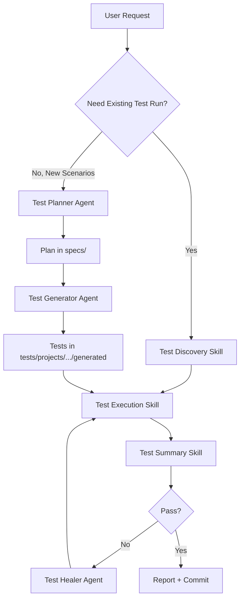

# NFS-QA-Automation

Playwright QA automation for the Student Loan Refinance flow.

## Framework Overview

The repository now supports a layered architecture for hybrid migration and AI-assisted automation:

- `web/`: TypeScript page objects, locators, resilience helpers, and migrated UI specs
- `mobile/`: WebdriverIO + Appium scaffolding for native Android and future iOS/TestFlight coverage
- `api/`: API client wrappers, schema contracts, and API tests
- `ai/`: agents for test generation, failure analysis, self-healing, and coverage analysis
- `core/`: shared cross-layer utilities

All Playwright specs live under `tests/projects/student-loan-refi`.

## AI Framework Layout

All agent framework assets are centralized under `ai/agents`:

- `ai/agents/agents`: agent mode files (`*.agent.md`)
- `ai/agents/prompts`: user-facing prompts (`*.prompt.md`)
- `ai/agents/skills`: reusable operating skills (`*/SKILL.md`)

### End-to-End Agent Flow



### How To Use Agents In This Repo

1. Start from an orchestrator or planner request.
2. Run the narrowest possible test first (single spec, single browser).
3. Use healer only after reproducing failures in a focused run.
4. Generate new tests into `tests/projects/<project>/generated/`.

### How To Write Skills

1. Create `ai/agents/skills/<skill-name>/SKILL.md`.
2. Add frontmatter: `name`, `description`, `argument-hint`.
3. Include sections: `When to Use`, `Inputs`, `Procedure`, `Output Contract`, `Guardrails`.
4. Use template: [ai/agents/skills/SKILL_TEMPLATE.md](ai/agents/skills/SKILL_TEMPLATE.md).

### How To Write Prompts

1. Create `ai/agents/prompts/<intent>.prompt.md`.
2. Add frontmatter: `name`, `description`, `argument-hint`, `agent`.
3. Define input expectations and output format explicitly.
4. Use template: [ai/agents/prompts/PROMPT_TEMPLATE.md](ai/agents/prompts/PROMPT_TEMPLATE.md).

### How To Write Agents

1. Create `ai/agents/agents/<agent-name>.agent.md`.
2. Define mission, workflow, and boundaries.
3. Restrict tools to the minimal required set.
4. Use template: [ai/agents/agents/AGENT_TEMPLATE.md](ai/agents/agents/AGENT_TEMPLATE.md).

## Current Scope

This repository is focused on the student-loan-refi suite under [tests/projects/student-loan-refi](tests/projects/student-loan-refi). The active profile source of truth is [test-data/student-loan-refi/student-loan-refi.yml](test-data/student-loan-refi/student-loan-refi.yml). The root [`.env`](.env) file is kept as a compatibility copy of the same profile data.

## Directory Conventions

- Use repo-relative paths in docs and prompts (for example `tests/projects/...`), not leading slash paths like `/tests/...`.
- Keep test data by project under `test-data/<project>/` with YAML files for that project.
- Keep test specs by project under `tests/projects/<project>/`.
- For this repository, active project paths are:
	- `test-data/student-loan-refi/student-loan-refi.yml`
	- `tests/projects/student-loan-refi/`

The old [test-data/student-loan-refi/profiles.json](test-data/student-loan-refi/profiles.json) file has been removed.

## Setup

Prerequisites:

- Node.js 16+ and npm.
- Android Studio with an emulator or a connected device for Android app runs.
- Appium 3 for mobile execution.
- For iOS later: a real device or TestFlight access, plus Apple signing/provisioning configured outside the repo.

Install dependencies and browsers:

```bash
npm install
npx playwright install
```

Install the mobile runtime after the package dependencies are added:

```bash
npm run typecheck:mobile
```

The mobile scaffold expects the Android APK at:

```text
test-data/mobile-app/gri/android/app.apk
```

You can override it with `MOBILE_ANDROID_APP_PATH` if you later switch to a Firebase download step or another local artifact path.

Mobile environment variables used by the scaffold:

- `MOBILE_PLATFORM`: defaults to `android`
- `MOBILE_ANDROID_APP_PATH`: defaults to `test-data/mobile-app/gri/android/app.apk`
- `MOBILE_IOS_MODE`: defaults to `testflight`
- `MOBILE_APP_PACKAGE`: optional Android package name once discovery is complete
- `MOBILE_APP_ACTIVITY`: optional Android launch activity once discovery is complete

## Running Tests

Run the student-loan-refi suite with Chromium:

```bash
npx playwright test tests/projects/student-loan-refi --project=chromium
```

Run with project tagging for grouped reports:

```bash
npm run test:project:student-loan-refi
```

Run the full Playwright suite:

```bash
npx playwright test
```

Run the student-loan-refi suite:

```bash
npm run test:web
```

Run cross-browser:

```bash
npm run test:web:cross-browser
```

Run the mobile Android scaffold:

```bash
npm run test:mobile:android
```

Run the mobile iOS/TestFlight scaffold later:

```bash
npm run test:mobile:ios
```

Run TypeScript validation:

```bash
npm run typecheck
```

Run mobile TypeScript validation:

```bash
npm run typecheck:mobile
```

Open the latest HTML report:

```bash
npx playwright show-report
```

## Profile Data

The test helpers load profile values through dotenv from [test-data/student-loan-refi/student-loan-refi.yml](test-data/student-loan-refi/student-loan-refi.yml) (or `.yaml` when present). `loadProfile(PROFILE)` copies `KEY_PROFILE` values into the base keys used by the tests, for example `FIRST_NAME_LK1` becomes `FIRST_NAME`.

Profiles are grouped as follows:

- Eligible: `LK1` to `LK14`
- Credit decline: `LK_CD1` to `LK_CD10`
- No credit: `LK_NC1` to `LK_NC10`
- Ineligible: `LK_IN1` to `LK_IN10`
- Earnest aliases: `ER_OFFER_SUCCESS`, `ER_CD_BANKRUPTCY`, `ER_CD_LOW_FICO`, `ER_0`

Required keys for each profile include:

- `FIRST_NAME`, `LAST_NAME`, `EMAIL`, `PHONE`, `DOB`, `SSN`
- `LOAN_AMOUNT`, `MONTHLY_PAYMENT`, `INTEREST_RATE`, `LOAN_TYPE`
- `ADDRESS`, `SCHOOL`, `DEGREE_LEVEL`, `GRADUATION_DATE`
- `INCOME_TYPE`, `EMPLOYER`, `OCCUPATION`, `ANNUAL_INCOME`, `EMPLOYMENT_START`
- `CITIZEN_STATUS`, `CREDIT_SCORE`, `HOUSING_TYPE`, `HOUSING_COST`, `TOTAL_ASSETS`

## Test Flow

The shared flow lives in [tests/projects/student-loan-refi/test-setup.ts](tests/projects/student-loan-refi/test-setup.ts). It handles:

- loading the selected profile into environment variables
- driving the refinance form
- detecting offer vs no-offer outcomes
- writing screenshots and markdown reports into Playwright output folders

Most specs in [tests/projects/student-loan-refi](tests/projects/student-loan-refi) are thin wrappers that set `PROFILE` and call `runRefinanceFlow(page, PROFILE)`.

## Repository Notes

- [package.json](package.json) contains npm shortcuts for the Playwright suite.
- [package.json](package.json) also contains the new mobile runner placeholders and validation entry points.
- [scripts/generate_tests.js](scripts/generate_tests.js) is a legacy generator that still targets root-level spec files.
- [scripts/generate-test.js](scripts/generate-test.js) is the new CLI for generated specs in `tests/projects/student-loan-refi/generated`.
- [playwright.config.ts](playwright.config.ts) defines retries, reporters, project-scoped reports, and run artifacts under `test-results/`.
- [AGENTS.md](AGENTS.md) and [ai/agents/skills/playwright-framework-context/SKILL.md](ai/agents/skills/playwright-framework-context/SKILL.md) contain the repo guidance used by agents.
- [ai/agents/readme-agents.md](ai/agents/readme-agents.md) is the canonical guide for writing and using agents, prompts, and skills.
- Reports and artifacts are written under `test-results/<MMDDYYYY>/` and grouped by `TEST_PROJECT`.

## Mobile Scaffold

The mobile layer is intentionally Android-first:

- Android uses the local APK at `test-data/mobile-app/gri/android/app.apk` until Firebase-based downloading is introduced later.
- iOS is documented as TestFlight-only for now, so the scaffold keeps placeholder paths and config without assuming sideloaded IPA access.
- The first mobile specs will live under `mobile/tests/android/` and use reusable page objects in `mobile/src/`.

Recommended mobile workflow:

1. Install dependencies.
2. Confirm Appium is available on your machine or in your CI environment.
3. Start the Android emulator before running the test. For the local AVD used in this repo, run:

```bash
/Users/jameshc/Library/Android/sdk/emulator/emulator -avd Medium_Phone_API_36.1
```

4. Verify the emulator is visible to adb before you run WDIO:

```bash
/Users/jameshc/Library/Android/sdk/platform-tools/adb devices
```

5. Wait until the device shows as `device`, not `offline`.
6. Set any optional environment variables such as `MOBILE_ANDROID_APP_PATH`.
7. Run `npm run test:mobile:android`.
8. Once discovery is complete, wire the discovered Android package/activity into the config and replace the placeholder selectors with real accessibility IDs.

Future Firebase automation will replace the static APK path with a download step before the run starts.

## AI Test Generation

Generate a baseline runnable test from ticket data:

```bash
node scripts/generate-test.js --jira PROJ-123 --summary "new no-offer validation" --description "Validate no-offer messaging for decline profile"
```

See [docs/agents/test-generator-agent.md](docs/agents/test-generator-agent.md) for details.

## Troubleshooting

- If profile values are missing, confirm the `KEY_PROFILE` entries exist in [test-data/student-loan-refi/student-loan-refi.yml](test-data/student-loan-refi/student-loan-refi.yml) (or `.yaml`) or in `.env`.
- If a run fails, check the latest files in `test-results/` and the Playwright HTML report.
- If you are adding new profiles, keep the YAML and `.env` copies aligned so `loadProfile(PROFILE)` continues to work.
