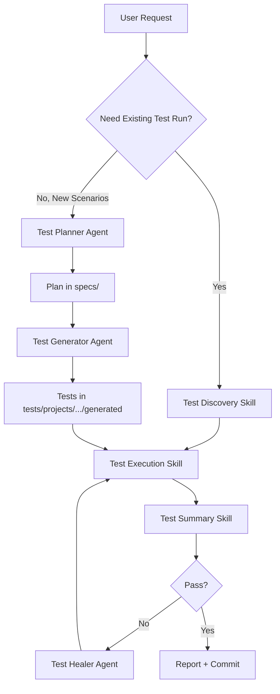

# NFS-QA-Automation

Playwright QA automation for the Student Loan Refinance flow.

## Framework Overview

The repository now supports a layered architecture for hybrid migration and AI-assisted automation:

- `web/`: TypeScript page objects, locators, resilience helpers, and migrated UI specs
- `mobile/`: WebdriverIO + Appium scaffolding for native Android, iOS simulator, and iOS real-device/TestFlight coverage, with config-driven build selection per environment
- `api/`: API client wrappers, schema contracts, and API tests
- `ai/`: agents for test generation, failure analysis, self-healing, and coverage analysis
- `core/`: shared cross-layer utilities

Playwright specs live under `tests/projects/`. The active UI suites are:

- `tests/projects/student-loan-refi` for Student Loan Refinance
- `tests/projects/student-IDR` for Student IDR / forgiveness

## AI Framework Layout

All agent framework assets are centralized under `ai/jobs`:

- `ai/jobs/agents`: agent mode files (`*.agent.md`)
- `ai/jobs/prompts`: user-facing prompts (`*.prompt.md`)
- `ai/jobs/skills`: reusable operating skills (`*/SKILL.md`)

### End-to-End Agent Flow


```mermaid
flowchart TD
	A[User Request] --> B{Need Existing Test Run?}
	B -->|Yes| C[Test Discovery Skill]
	C --> D[Test Execution Skill]
	D --> E[Test Summary Skill]
	E --> F{Pass?}
	F -->|No| G[Test Healer Agent]
	G --> D
	F -->|Yes| H[Report + Commit]

	B -->|No, New Scenarios| I[Test Planner Agent]
	I --> J[Plan in specs/]
	J --> K[Test Generator Agent]
	K --> L[Tests in tests/projects/.../generated]
	L --> D
```

### How To Use Agents In This Repo

1. Start from an orchestrator or planner request.
2. Run the narrowest possible test first (single spec, single browser).
3. Use healer only after reproducing failures in a focused run.
4. Generate new tests into `tests/projects/<project>/generated/`.

### How To Write Skills

1. Create `ai/jobs/skills/<skill-name>/SKILL.md`.
2. Add frontmatter: `name`, `description`, `argument-hint`.
3. Include sections: `When to Use`, `Inputs`, `Procedure`, `Output Contract`, `Guardrails`.
4. Use template: [ai/jobs/skills/SKILL_TEMPLATE.md](ai/jobs/skills/SKILL_TEMPLATE.md).

### How To Write Prompts

1. Create `ai/jobs/prompts/<intent>.prompt.md`.
2. Add frontmatter: `name`, `description`, `argument-hint`, `agent`.
3. Define input expectations and output format explicitly.
4. Use template: [ai/jobs/prompts/PROMPT_TEMPLATE.md](ai/jobs/prompts/PROMPT_TEMPLATE.md).

### How To Write Agents

1. Create `ai/jobs/agents/<agent-name>.agent.md`.
2. Define mission, workflow, and boundaries.
3. Restrict tools to the minimal required set.
4. Use template: [ai/jobs/agents/AGENT_TEMPLATE.md](ai/jobs/agents/AGENT_TEMPLATE.md).

## Current Scope

This repository includes Student Loan Refinance and Student IDR suites. Their profile sources are [test-data/student-loan-refi/student-loan-refi.yml](test-data/student-loan-refi/student-loan-refi.yml) and [test-data/student-IDR/student-IDR.yml](test-data/student-IDR/student-IDR.yml). The root `.env` file is a compatibility source for shared environment settings.

## Directory Conventions

- Use repo-relative paths in docs and prompts (for example `tests/projects/...`), not leading slash paths like `/tests/...`.
- Keep test data by project under `test-data/<project>/` with YAML files for that project.
- Keep test specs by project under `tests/projects/<project>/`.
- For this repository, active project paths are:
	- `test-data/student-loan-refi/student-loan-refi.yml`
	- `tests/projects/student-loan-refi/`
	- `test-data/student-IDR/student-IDR.yml`
	- `tests/projects/student-IDR/`

The old `test-data/student-loan-refi/profiles.json` file has been removed.

Reporting and run artifacts

- Run artifacts (generated credentials, Playwright reports, screenshots, traces) are stored under `test-results/` and are not intended to be committed.
- A helper `scripts/organize-reports.js` moves stray human-written reports into `test-results/YYYY-MM-DD/<project>/`.
- The Playwright run is configured with a custom reporter that writes a Markdown summary into `test-results/YYYY-MM-DD/<TEST_PROJECT>/` (set `TEST_PROJECT` when running to classify the output).

## Setup

Prerequisites:

- Node.js 16+ and npm.
- Android Studio with an emulator or a connected device for Android app runs.
- Appium 3 for mobile execution.
- For iOS runs: Xcode, plus either a checked-out app clone to build from or a prebuilt `.app`/`.ipa`.
- For Android builds pulled from Firebase: the Android SDK build-tools (for `aapt2`), and either an App Distribution API token or a saved browser session.
- For iOS later/TestFlight: a real device, plus Apple signing/provisioning configured outside the repo.
- Install the Appium XCUITest driver before the first iOS run: `npx appium driver install xcuitest`.

Install dependencies and browsers:

```bash
npm install
npx playwright install
```

Install the mobile runtime after the package dependencies are added:

```bash
npm run typecheck:mobile
```

The mobile scaffold expects the Android APK at:

```text
test-data/mobile-app/gri/android/app.apk
```

That file is the `qa-local` build. Firebase App Distribution and CI URLs are also
supported — see [Choosing an Android build](#choosing-an-android-build).
`MOBILE_ANDROID_APP_PATH` still bypasses the picker and installs a specific file.

Mobile environment variables used by the scaffold:

- `MOBILE_PLATFORM`: defaults to `android`
- `MOBILE_ANDROID_BUILD`: name of a build defined under `android.builds` in `test-data/mobile-app/gri/android/config.yml` (for example `qa-local`, `qa-firebase`, `stage-firebase`, `prod-firebase`, `qa-url`); falls back to `android.defaultBuild`
- `MOBILE_ANDROID_APP_PATH`: installs this apk directly and skips the build picker
- `MOBILE_ANDROID_FIREBASE_APP_ID` / `MOBILE_ANDROID_FIREBASE_RELEASE`: override the app id and which release to pull (`latest`, a versionName, a versionCode, or `"1.43-qa (1130)"`)
- `MOBILE_ANDROID_FIREBASE_WEB_URL`: App Distribution page used by the Playwright downloader
- `MOBILE_FIREBASE_HEADLESS`: `true` runs the Playwright downloader headless; headed by default because Google re-challenges headless sessions
- `FIREBASE_ACCESS_TOKEN` / `MOBILE_FIREBASE_KEY_FILE`: credentials for the App Distribution API
- `MOBILE_ANDROID_REFRESH`: `true` re-downloads a Firebase release instead of reusing the cached copy
- `MOBILE_ANDROID_APP_URL` / `MOBILE_ANDROID_AUTH_HEADER`: apk URL and optional auth header for `url` builds
- `MOBILE_BUNDLETOOL_JAR`: bundletool jar used to convert an `.aab` into a universal apk
- `MOBILE_AAPT2`: optional path to `aapt2`; normally found in the Android SDK build-tools
- `MOBILE_IOS_BUILD`: name of a build defined under `ios.builds` in `test-data/mobile-app/gri/ios/config.yml` (for example `qa-xcode`, `stage-xcode`, `prod-xcode`, `qa-ipa`, `stage-testflight`); falls back to `ios.defaultBuild`
- `MOBILE_IOS_REPO_ROOT` / `MOBILE_IOS_REPO_VERSION`: where the app clones live and which release folder to build (for example `30.3`); the newest clone wins by default
- `MOBILE_IOS_MODE`: `testflight`, `real-device`, or `simulator`; normally taken from the selected build's `source`
- `MOBILE_IOS_XCODE_BUILD`: `missing` (reuse the last artifact) or `always` (recompile the working copy) for `xcode` builds
- `MOBILE_IOS_XCODE_TARGET`: `simulator` or `device` override for `xcode` builds
- `MOBILE_IOS_TEAM_ID`: signing team used when exporting an `.ipa` from an `xcode` device build
- `MOBILE_IOS_APP_PATH`: `.app` bundle for simulator builds; defaults to the build's `appPath`
- `MOBILE_IOS_IPA_PATH` / `MOBILE_IOS_IPA_URL`: signed `.ipa` for real-device builds; a URL is downloaded once into `mobile/.builds`
- `MOBILE_IOS_IPA_AUTH_HEADER`: optional header sent when downloading `MOBILE_IOS_IPA_URL` (store it encrypted as `ipaAuthHeader` instead where possible)
- `MOBILE_IOS_DEVICE_UDID`: required for `ipa` and `testflight` builds; defaults to the build's `deviceUdid`
- `MOBILE_IOS_PLATFORM_VERSION`: optional override for the Xcode Simulator runtime version; normally auto-detected from installed runtimes
- `MOBILE_APP_PACKAGE`: optional Android package name once discovery is complete
- `MOBILE_APP_ACTIVITY`: optional Android launch activity once discovery is complete

### Choosing an Android build

`test-data/mobile-app/gri/android/config.yml` holds named builds under
`android.builds`, the same way iOS does:

| `source` | Where the apk comes from |
| --- | --- |
| `local` | A file already on disk, such as `test-data/mobile-app/gri/android/app.apk` |
| `firebase` | The newest (or a named) Firebase App Distribution release, through the REST API |
| `firebase-web` | The same releases, downloaded from the App Distribution page with Playwright (no project role needed) |
| `url` | Any CI artifact reachable over http, with an optional auth header |

Whatever the source, the apk is republished to
`test-data/mobile-app/gri/android/<version>/<environment>/app.apk` with a
`build-info.json` recording the versionName, versionCode, package, Firebase
release and download time:

```
test-data/mobile-app/gri/android/1.43/qa/app.apk     + build-info.json
test-data/mobile-app/gri/android/1.43/stage/app.apk  + build-info.json
test-data/mobile-app/gri/android/1.43/prod/app.apk   + build-info.json
```

The version folder is the numeric part of the apk's `versionName` read with
`aapt2 dump badging`, so `1.43-qa` and `1.43-stage` publish side by side under
`1.43/`. The environment comes from the build's `environment`, or from the
package suffix (`.qa`, `.stage`, `.dev`, otherwise `prod`).

Downloading from Firebase App Distribution uses the
`firebaseappdistribution.googleapis.com` REST API, which needs an OAuth token
with the `cloud-platform` scope and the *Firebase App Distribution Admin* role:

```bash
# Option A: a short-lived token from your own gcloud login
export FIREBASE_ACCESS_TOKEN="$(gcloud auth print-access-token)"

# Option B: a service account key (set android.firebase.serviceAccountKeyFile)
#   the key is signed into a token locally; nothing is uploaded
```

The app id is the one shown in the Firebase console under *Project settings ▸
Your apps*, in the form `1:1234567890:android:abc123`. Put one per environment in
`android.builds.<name>.firebase.appId`.

If a release was uploaded as an app bundle, the download is an `.aab`, which
Appium cannot install. Point `android.bundletoolJar` (or `MOBILE_BUNDLETOOL_JAR`)
at a [bundletool](https://github.com/google/bundletool/releases) jar and it is
converted to a universal apk automatically. That apk is signed with the local
debug keystore, so it cannot upgrade a Play-signed install and any
signature-bound feature (Google sign-in, SafetyNet/Play Integrity) may behave
differently — prefer an apk release for verification-heavy suites. Releases that
Firebase distributes through Google Play have no downloadable binary at all and
must be installed from the tester app by hand.

### Downloading builds without Firebase API access

The REST API needs a role on the project. If you only have tester access, the
`firebase-web` source drives the App Distribution page in a browser instead: if
you can see the build, this can fetch it.

Google blocks scripted sign-in, so you sign in by hand once and the session is
reused after that, exactly like the Outlook and Google Voice inboxes:

```bash
# 1. Sign in once, by hand, and save the session
npm run setup:firebase-session

# 2. Put the releases page you landed on into android.firebase.webUrl,
#    then list what is available
npm run download:firebase-build -- --list

# 3. Download a specific build and file it under <version>/<environment>/
npm run download:firebase-build -- --release "1.43-qa (1130)" --publish

# Or let a test run fetch it
MOBILE_ANDROID_BUILD=qa-web npm run test:mobile:android:create-account
```

The page is matched on text (`versionName (versionCode)`) rather than on
generated class names, and the script tries a direct link, a Download button,
then a row overflow menu. If the markup changes, `--manual` opens the page with
your session, waits up to five minutes for you to click Download yourself, and
still files the result correctly:

```bash
npm run download:firebase-build -- --manual --publish
```

Screenshots of what the browser saw land in `test-results/firebase-download/`.
The session expires periodically — re-run `npm run setup:firebase-session` when
the script reports that it was bounced to the Google sign-in page.

Two lighter-weight alternatives worth asking your Firebase admin about:

- The **Firebase App Distribution Viewer** role (`roles/firebaseappdistro.viewer`)
  is enough for the API-based `firebase` source — it grants read access only, so
  it is a much smaller ask than Admin.
- A tester invite gives you a per-release download link you can paste into a
  `url` build, though those links expire.

### Finding the Android build under test

| Environment | Package | Typical versionName |
| --- | --- | --- |
| QA | `com.guaranteedrate.superapp.qa` | `1.43-qa` |
| Stage | `com.guaranteedrate.superapp.stage` | `1.43-stage` |
| Prod | `com.guaranteedrate.superapp` | `1.43` |

```bash
npm run build:mobile:android                  # fetch qa, stage and prod from Firebase
npm run build:mobile:android -- qa            # only that environment
npm run build:mobile:android -- qa-local      # publish the checked-in apk
MOBILE_ANDROID_FIREBASE_RELEASE="1.43-qa (1130)" npm run build:mobile:android -- qa

# What is currently published?
cat test-data/mobile-app/gri/android/*/*/build-info.json

# Version straight from an apk
"$ANDROID_SDK_ROOT"/build-tools/*/aapt2 dump badging \
  test-data/mobile-app/gri/android/1.43/qa/app.apk | head -1

# Version of what is installed on the device
adb shell dumpsys package com.guaranteedrate.superapp.qa | grep -E 'versionName|versionCode'

# Run against a specific build
MOBILE_ANDROID_BUILD=qa-firebase npm run test:mobile:android:create-account
```

### Choosing an iOS build

`test-data/mobile-app/gri/ios/config.yml` holds named builds, each declaring how the
app reaches the target:

| `source` | Target | How the app is installed |
| --- | --- | --- |
| `simulator` | iOS Simulator | Appium installs the local `.app` bundle |
| `xcode` | Simulator or real device | `xcodebuild` compiles the app from the checked-out Xcode project |
| `ipa` | Connected real device | Appium installs `ipaPath`, or downloads `ipaUrl` first |
| `testflight` | Connected real device | You install the build from TestFlight by hand; the run only launches it |

TestFlight cannot run on the iOS Simulator — Apple does not ship the TestFlight app
for simulators, and TestFlight builds are device-only. Use a `simulator`, `xcode`
or `ipa` build instead.

An `xcode` build points at the app repo's `.xcodeproj` and a scheme such as
`GRI - QA`, `GRI - Stage` or `GRI - Release`. Clone folders are named after the
release (`SuperApp-iOS-30.3`), so the folder name selects the version and the
newest clone wins unless `ios.repo.version` or `MOBILE_IOS_REPO_VERSION` pins
one. A simulator target produces a `.app`; a device target archives and exports
a signed `.ipa`. The automation only reads and builds that repo — it never
commits, pushes, or otherwise writes to it.

Each artifact is published to
`test-data/mobile-app/gri/ios/<version>/<environment>/` with a `build-info.json`
recording the marketing version, build number, bundle id, scheme, git branch and
commit, so the build under test is always identifiable:

```
test-data/mobile-app/gri/ios/30.3/qa/GRI QA.app        + build-info.json
test-data/mobile-app/gri/ios/30.3/stage/GRI Stage.app  + build-info.json
test-data/mobile-app/gri/ios/30.3/prod/Rate.app        + build-info.json
```

The version in the folder name is read from the built app's
`CFBundleShortVersionString`, falling back to the clone folder name. Intermediate
builds and logs stay in `mobile/.builds` and are reused until you pass
`MOBILE_IOS_XCODE_BUILD=always`. Leave code signing enabled — an unsigned
simulator build compiles but fails at runtime during account registration.

### Finding the iOS build under test

| Environment | Scheme | Configuration | Bundle id | Product |
| --- | --- | --- | --- | --- |
| QA | `GRI - QA` | `QA` | `com.guaranteedrate.superapp.qa` | `GRI QA.app` |
| Stage | `GRI - Stage` | `Stage` | `com.guaranteedrate.superapp.stage` | `GRI Stage.app` |
| Prod | `GRI - Release` | `Release` | `com.guaranteedrate.superapp` | `Rate.app` |

```bash
npm run build:mobile:ios                      # build qa, stage and prod
npm run build:mobile:ios -- qa stage          # only those environments
npm run build:mobile:ios -- qa-xcode-device   # signed .ipa for a real device

# What is currently published?
cat test-data/mobile-app/gri/ios/*/*/build-info.json

# Version straight from an artifact's metadata
plutil -extract CFBundleShortVersionString raw -o - "test-data/mobile-app/gri/ios/30.3/qa/GRI QA.app/Info.plist"
plutil -extract CFBundleVersion raw -o - "test-data/mobile-app/gri/ios/30.3/qa/GRI QA.app/Info.plist"

# Version the repo would produce, before building
cd "/Users/jameshc/iOS /SuperApp-iOS-30.3" && \
  xcodebuild -project SuperApp.xcodeproj -scheme "GRI - QA" -showBuildSettings \
  | grep -E 'MARKETING_VERSION|CURRENT_PROJECT_VERSION|PRODUCT_BUNDLE_IDENTIFIER'
```

```bash
npm run test:mobile:ios:create-account                     # qa-xcode (default)
npm run test:mobile:ios:create-account:stage-xcode
npm run test:mobile:ios:create-account:prod-xcode
MOBILE_IOS_XCODE_BUILD=always npm run test:mobile:ios:create-account
MOBILE_IOS_BUILD=stage-ipa npm run test:mobile:ios:create-account
npm run test:mobile:ios:create-account:qa-testflight
```

## Running Tests

Run the student-loan-refi suite with Chromium:

```bash
npx playwright test tests/projects/student-loan-refi --project=chromium
```

Run the Student IDR suite with Chromium:

```bash
npm run test:project:student-IDR -- --project=chromium --workers=1
```

Student IDR test cases, profile-backed test data, and the latest Jira-style execution report are documented in:

- [tests/projects/student-IDR/readme-projects.md](tests/projects/student-IDR/readme-projects.md)
- [test-data/student-IDR/04_final_test_cases_with_data.csv](test-data/student-IDR/04_final_test_cases_with_data.csv)
- [test-results/student-IDR-test-execution-report-2026-07-28.md](test-results/student-IDR-test-execution-report-2026-07-28.md)

Run with project tagging for grouped reports:

```bash
npm run test:project:student-loan-refi
```

Run the full Playwright suite:

```bash
npx playwright test
```

Run the API suite:

```bash
npm run test:api
```

The API runner reads JSON from `api/postman/` and `api/api-mappings/`, resolves Postman-style variables from `.env`, Postman environment JSON, and runtime saves, then executes through the Playwright `api-tests` project.

Run the student-loan-refi suite:

```bash
npm run test:web
```

Run cross-browser:

```bash
npm run test:web:cross-browser
```

Run the mobile Android scaffold:

```bash
npm run test:mobile:android
```

Fetch and publish Android builds before a run:

```bash
npm run build:mobile:android              # qa, stage and prod from Firebase
npm run build:mobile:android -- qa-local  # publish the checked-in apk
npm run setup:firebase-session            # one-time, for browser downloads
npm run download:firebase-build -- --list # what builds can be seen
```

Run a specific Android build:

```bash
MOBILE_ANDROID_BUILD=qa-firebase npm run test:mobile:android:create-account
```

Run the mobile iOS lane:

```bash
npm run test:mobile:ios
```

Build iOS artifacts from the local app clone:

```bash
npm run build:mobile:ios              # qa, stage and prod simulator apps
npm run build:mobile:ios -- qa stage  # only those environments
```

Run the mobile iOS simulator scaffold:

```bash
npm run test:mobile:ios:simulator
```

Example invocation pinned to one artifact:

```bash
MOBILE_PLATFORM=ios \
MOBILE_IOS_MODE=simulator \
MOBILE_IOS_APP_PATH="test-data/mobile-app/gri/ios/30.3/qa/GRI QA.app" \
MOBILE_IOS_BUNDLE_ID=com.guaranteedrate.superapp.qa \
npm run test:mobile:ios:simulator
```

TestFlight is still real-device only — Apple ships no TestFlight app for
simulators. Simulator runs use a `.app` built from the Xcode project or a local
artifact instead.

Run TypeScript validation:

```bash
npm run typecheck
```

Run mobile TypeScript validation:

```bash
npm run typecheck:mobile
```

Open the latest HTML report:

```bash
npx playwright show-report
```

## API Runner

The API framework lives under `api/` and is driven by the same Playwright runner used for UI tests.

Default files:

- `api/postman/collection.json`
- `api/postman/environment.qa.json`
- `api/api-mappings/api-mapping.json`

Environment variables used by the API runner:

- `BASE_URL`
- `API_TOKEN`
- `API_PROJECT`
- `POSTMAN_COLLECTION`
- `POSTMAN_ENV`
- `API_MAPPING_FILE`

Runtime values saved during a request can be reused later with Postman-style placeholders such as `{{customerId}}` or `{{orderId}}`.

Project-scoped assets live under `api/postman/<projectname>/` and `api/api-mappings/<projectname>/`. If `API_PROJECT=mobile`, the runners prefer `api/postman/mobile/*` and `api/api-mappings/mobile/*` before falling back to the root sample files.

For the step-by-step API usage guide, see [api/README.md](api/README.md).

## Profile Data

The test helpers load profile values through dotenv from [test-data/student-loan-refi/student-loan-refi.yml](test-data/student-loan-refi/student-loan-refi.yml) (or `.yaml` when present). `loadProfile(PROFILE)` copies `KEY_PROFILE` values into the base keys used by the tests, for example `FIRST_NAME_LK1` becomes `FIRST_NAME`.

Profiles are grouped as follows:

- Eligible: `LK1` to `LK14`
- Credit decline: `LK_CD1` to `LK_CD10`
- No credit: `LK_NC1` to `LK_NC10`
- Ineligible: `LK_IN1` to `LK_IN10`
- Earnest aliases: `ER_OFFER_SUCCESS`, `ER_CD_BANKRUPTCY`, `ER_CD_LOW_FICO`, `ER_0`

Required keys for each profile include:

- `FIRST_NAME`, `LAST_NAME`, `EMAIL`, `PHONE`, `DOB`, `SSN`
- `LOAN_AMOUNT`, `MONTHLY_PAYMENT`, `INTEREST_RATE`, `LOAN_TYPE`
- `ADDRESS`, `SCHOOL`, `DEGREE_LEVEL`, `GRADUATION_DATE`
- `INCOME_TYPE`, `EMPLOYER`, `OCCUPATION`, `ANNUAL_INCOME`, `EMPLOYMENT_START`
- `CITIZEN_STATUS`, `CREDIT_SCORE`, `HOUSING_TYPE`, `HOUSING_COST`, `TOTAL_ASSETS`

## Test Flow

The shared flow lives in [tests/projects/student-loan-refi/test-setup.ts](tests/projects/student-loan-refi/test-setup.ts). It handles:

- loading the selected profile into environment variables
- driving the refinance form
- detecting offer vs no-offer outcomes
- writing screenshots and markdown reports into Playwright output folders

Most specs in [tests/projects/student-loan-refi](tests/projects/student-loan-refi) are thin wrappers that set `PROFILE` and call `runRefinanceFlow(page, PROFILE)`.

## Repository Notes

- [package.json](package.json) contains npm shortcuts for the Playwright suite.
- [package.json](package.json) also contains the mobile runner, build and validation entry points.
- [scripts/build-ios-app.ts](scripts/build-ios-app.ts) builds and publishes iOS artifacts from the local app clone.
- [scripts/fetch-android-app.ts](scripts/fetch-android-app.ts) fetches and publishes Android artifacts.
- [scripts/setup-firebase-session.ts](scripts/setup-firebase-session.ts) and [scripts/download-firebase-build.ts](scripts/download-firebase-build.ts) download builds from the App Distribution web UI when there is no API access.
- [scripts/generate_tests.js](scripts/generate_tests.js) is a legacy generator that still targets root-level spec files.
- [scripts/generate-test.js](scripts/generate-test.js) is the new CLI for generated specs in `tests/projects/student-loan-refi/generated`.
- [playwright.config.ts](playwright.config.ts) defines retries, reporters, project-scoped reports, and run artifacts under `test-results/`.
- [AGENTS.md](AGENTS.md) and [ai/jobs/skills/playwright-framework-context/SKILL.md](ai/jobs/skills/playwright-framework-context/SKILL.md) contain the repo guidance used by agents.
- [ai/jobs/readme-agents.md](ai/jobs/readme-agents.md) is the canonical guide for writing and using agents, prompts, and skills.
- [test-data/mobile-app/gri/android/README.md](test-data/mobile-app/gri/android/README.md) and [test-data/mobile-app/gri/ios/README.md](test-data/mobile-app/gri/ios/README.md) document the per-platform build artifacts.
- Reports and artifacts are written under `test-results/<MMDDYYYY>/` and grouped by `TEST_PROJECT`.

## Mobile Scaffold

Both platforms now resolve the app under test from a named build in config,
rather than from a hardcoded path:

- Android builds are declared in `test-data/mobile-app/gri/android/config.yml`
  and can come from a local file, Firebase App Distribution (API or browser), or
  any CI url.
- iOS builds are declared in `test-data/mobile-app/gri/ios/config.yml` and can be
  a local `.app`, a build compiled from the Xcode project, a downloaded `.ipa`,
  or a TestFlight install. TestFlight remains real-device only.
- Whatever the source, the artifact is republished to
  `test-data/mobile-app/gri/<platform>/<version>/<environment>/` with a
  `build-info.json`, so the build a run used is always identifiable.
- Specs live under `mobile/tests/android/` and `mobile/tests/ios/` and use the
  reusable page objects in `mobile/src/`.

See [Choosing an Android build](#choosing-an-android-build) and
[Choosing an iOS build](#choosing-an-ios-build) for the full source tables.

iOS workflow:

1. Install the XCUITest driver if needed: `npx appium driver install xcuitest`.
2. Point `ios.repo.root` at the folder holding your app clones, or set
   `MOBILE_IOS_APP_PATH` to a prebuilt bundle.
3. Build the environments you need: `npm run build:mobile:ios`.
4. Run `npm run test:mobile:ios:create-account` (the build comes from
   `ios.defaultBuild`; override it with `MOBILE_IOS_BUILD`).
5. If Appium needs a different simulator runtime, set `MOBILE_IOS_PLATFORM_VERSION`.

The automation only reads and builds the app repo. It never commits, pushes, or
otherwise writes to it.

Android workflow:

1. Install dependencies and confirm Appium is available.
2. Start the emulator in its own long-lived terminal:

```bash
/Users/jameshc/Library/Android/sdk/emulator/emulator -avd Medium_Phone_API_36.1
```

3. Verify it is visible to adb and shows as `device`, not `offline`:

```bash
/Users/jameshc/Library/Android/sdk/platform-tools/adb devices
```

4. Fetch the build you want: `npm run build:mobile:android -- qa`.
5. Run `npm run test:mobile:android:create-account`, or set
   `MOBILE_ANDROID_BUILD` to pick a different build.

Verification codes are read from the inboxes configured in
`verificationInbox`; refresh the saved sessions with
`npm run setup:outlook-session` when a run reports an expired session.

## AI Test Generation

Generate a baseline runnable test from ticket data:

```bash
node scripts/generate-test.js --jira PROJ-123 --summary "new no-offer validation" --description "Validate no-offer messaging for decline profile"
```

See [docs/agents/test-generator-agent.md](docs/agents/test-generator-agent.md) for details.

## Troubleshooting

- If profile values are missing, confirm the `KEY_PROFILE` entries exist in [test-data/student-loan-refi/student-loan-refi.yml](test-data/student-loan-refi/student-loan-refi.yml) (or `.yaml`) or in `.env`.
- If a run fails, check the latest files in `test-results/` and the Playwright HTML report.
- If you are adding new profiles, keep the YAML and `.env` copies aligned so `loadProfile(PROFILE)` continues to work.

Mobile:

- If a run installs the wrong build, check the log line `[mobile] using <platform> build "<name>"` and the `build-info.json` next to the published artifact.
- If an iOS build compiles but account registration never reaches the verification prompt, code signing was skipped. Leave `xcode.codeSigning` on.
- If a verification step times out waiting for an email, the saved mailbox session has expired. Re-run `npm run setup:outlook-session`.
- If a Firebase download reports being bounced to the Google sign-in page, re-run `npm run setup:firebase-session`.
- If `aapt2` cannot be found, set `MOBILE_AAPT2` or install the Android SDK build-tools; without it the apk still installs but is published as `unknown`.
- Start the Android emulator in its own terminal. Launching it as a background job in a terminal that is later cleaned up will stop the emulator mid-run.
