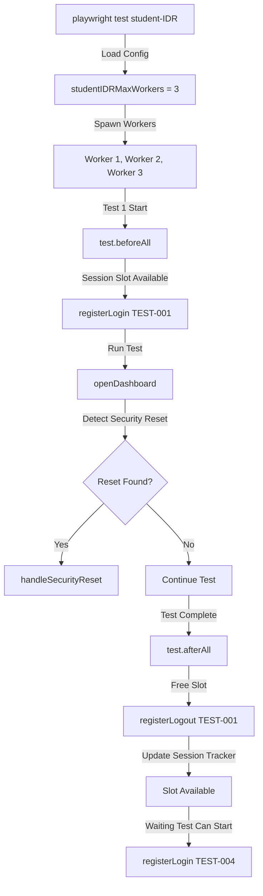

# Security Reset Prevention - Implementation Summary

## Overview
Implemented a comprehensive session management system to prevent "too many concurrent sessions" security resets in Student IDR tests. The system enforces a maximum of 3 concurrent active sessions and provides automatic detection and recovery.

---

## Components Implemented

### 1. Session Manager (`session-manager.ts`)
**Location:** `tests/projects/student-IDR/session-manager.ts`

**Responsibilities:**
- Tracks all active login sessions in real-time
- Enforces MAX_CONCURRENT_SESSIONS = 3 limit
- Provides session lifecycle management (register login → register logout)
- Persists session state to `.session-tracker.json` for cross-process visibility
- Implements automatic wait-for-slot mechanism with configurable timeout (default 5 minutes)

**Key Exports:**

| Export | Purpose |
|--------|---------|
| `getSessionManager()` | Get singleton instance of SessionManager |
| `registerLogin(sessionId, email)` | Record a new login; throws if at capacity |
| `registerLogout(sessionId)` | Record a logout; frees a slot |
| `registerError(sessionId, error)` | Record an error (security reset, etc.) |
| `canStartNewSession()` | Check if new session allowed |
| `getActiveSessions()` | Get count of currently active sessions |
| `waitForAvailableSlot(timeout)` | Block until a session slot is free |
| `detectSecurityReset(page)` | Scan page content for security reset patterns |
| `handleSecurityReset(page, sessionId, email)` | Log out and report security reset |

**How It Works:**
1. On test startup, `test.beforeAll` calls `registerLogin()`
2. If 3 sessions already active, throws error immediately
3. Parallel tests wait for other tests to finish via `waitForAvailableSlot()`
4. On test cleanup, `test.afterAll` calls `registerLogout()` to free the slot
5. Session records persisted to disk so visibility spans process boundaries

---

### 2. Playwright Config Updates (`playwright.config.ts`)
**Change:** Added worker limit for Student IDR project

```typescript
// Enforce session limits for Student IDR tests to prevent security resets
const studentIDRMaxWorkers = testProject === 'student-IDR' ? 3 : undefined;

export default defineConfig({
  // ...
  workers: process.env.CI ? 1 : studentIDRMaxWorkers,
```

**Effect:**
- **Local runs** (`student-IDR` project): Maximum 3 parallel workers
- **CI runs**: Always 1 worker (CI security is stricter)
- **Other projects**: No limit (allow full parallelization)

---

### 3. Dashboard Spec Updates (`DASHBOARD-COMPREHENSIVE.spec.ts`)

**Imports Added:**
```typescript
import { 
  getSessionManager, 
  withSessionLimit, 
  detectSecurityReset, 
  handleSecurityReset 
} from './session-manager';
```

**Session Lifecycle:**
```typescript
test.beforeAll(async () => {
  // Register session at start of test suite
  sessionManager.registerLogin(TEST_SESSION_ID, sessionEmail);
});

test.afterAll(async () => {
  // Cleanup session at end of test suite
  sessionManager.registerLogout(TEST_SESSION_ID);
  // Print summary for debugging
});
```

**Enhanced Dashboard Navigation:**
```typescript
async function openDashboard(page: Page) {
  // Check for security reset BEFORE flow
  if (await detectSecurityReset(page)) {
    await handleSecurityReset(page, TEST_SESSION_ID, sessionEmail);
    throw new Error('Security reset detected - cannot proceed');
  }

  // Perform login flow
  await runIdrFlow(page, PROFILE);
  
  // Handle redirect to Rate dashboard (domain switching)
  if (page.url().includes('my.gr-dev.com')) {
    // Navigate back to Student Loans app
  }
  
  // Check for security reset AFTER flow
  if (await detectSecurityReset(page)) {
    await handleSecurityReset(page, TEST_SESSION_ID, sessionEmail);
    throw new Error('Security reset detected - session was closed');
  }
}
```

---

## Security Reset Detection

**Patterns Detected:**
- "security reset"
- "unusual activity"
- "verify identity"
- "account locked"
- "too many attempts"
- "please log in again"
- "session expired"

**Detection Points:**
1. **Before dashboard flow** - Catch lingering redirects from previous runs
2. **After dashboard flow** - Catch mid-session lockouts
3. **On error** - Log and mark session as errored

**Recovery Strategy:**
1. Navigate to login page
2. Register error in session tracker
3. Mark session as inactive
4. Print summary for debugging
5. Throw error to fail test gracefully

---

## Concurrent Session Scenarios

### Scenario 1: Normal Parallel Execution (3 Tests)
```
Test 1: Register → Run (60s) → Cleanup ✓
Test 2: Register → Run (60s) → Cleanup ✓
Test 3: Register → Run (60s) → Cleanup ✓
```
**Result:** All 3 tests run in parallel (capacity met), complete in ~60s total

### Scenario 2: High Concurrency (5+ Tests)
```
Test 1: Register → Run (60s) → Cleanup ✓
Test 2: Register → Run (60s) → Cleanup ✓
Test 3: Register → Run (60s) → Cleanup ✓
Test 4: WAIT (5 slots full)
Test 5: WAIT (5 slots full)
...
Test 4 starts after Test 1 completes → Run → Cleanup ✓
```
**Result:** Tests queue automatically, complete in ~120s (2 batches)

### Scenario 3: Security Reset During Test
```
Test A: Register → Run (30s in) → SECURITY RESET DETECTED
├─ Mark as errored
├─ Cleanup
└─ Fail test

Test B: Waiting → Can now register → Run → Cleanup ✓
```
**Result:** Failing test cleans up gracefully, doesn't block other tests

---

## Session Tracker File

**Location:** `.test-results/.session-tracker.json`

**Format:**
```json
{
  "test-1726123456789-a1b2c": {
    "sessionId": "test-1726123456789-a1b2c",
    "email": "user@example.com",
    "status": "active",
    "startTime": 1726123456789
  },
  "test-1726123456900-x9y8z": {
    "sessionId": "test-1726123456900-x9y8z",
    "email": "user2@example.com",
    "status": "inactive",
    "startTime": 1726123456900,
    "endTime": 1726123520000
  }
}
```

**Cleanup:** Sessions older than 1 hour are automatically pruned on load

---

## Test Execution Flow



---

## Error Handling

| Scenario | Behavior |
|----------|----------|
| **All 3 slots full** | New test waits up to 5 min for slot |
| **Slot timeout (5 min)** | Test fails with clear error message |
| **Email already in use** | Test fails immediately with error |
| **Security reset detected** | Test logs error, cleans up, fails gracefully |
| **Session error on cleanup** | Session marked as errored, reported in summary |
| **Disk I/O failure** | Warnings logged, tests continue (fallback to memory-only) |

---

## Monitoring & Debugging

### View Active Sessions
```json
{
  "totalSessions": 3,
  "activeSessions": 3,
  "inactiveSessions": 0,
  "errorSessions": 0,
  "maxConcurrent": 3,
  "activeEmails": [
    "user1@example.com",
    "user2@example.com", 
    "user3@example.com"
  ],
  "errorDetails": []
}
```

### Console Output During Test
```
✓ Session registered: user@example.com (1/3 active)
✓ Test suite started - Session registered for user@example.com
⏳ Waiting for session slot... (3/3 active)
✓ Session closed: user@example.com
✓ Test suite completed - Session closed for user@example.com

📊 Final Session Summary:
{
  "totalSessions": 4,
  "activeSessions": 0,
  "inactiveSessions": 4,
  ...
}
```

---

## Deployment Checklist

- [x] Session manager created with 3-session limit
- [x] Playwright config enforces 3 workers for student-IDR
- [x] Dashboard spec imports session manager
- [x] Dashboard spec registers sessions in beforeAll/afterAll
- [x] Dashboard spec detects security resets before and after flow
- [x] Security reset recovery implemented
- [x] Domain redirect handling (Rate dashboard) added
- [x] Session tracking persisted to disk
- [x] Automatic session pruning (1 hour retention)
- [x] Test timeout wait-for-slot (5 min default)
- [x] Console logging for debugging
- [x] Error reporting with session summary

---

## Running Tests

```bash
# Run Student IDR tests (max 3 parallel workers)
npx playwright test --project=student-IDR

# Run specific test file
npx playwright test tests/projects/student-IDR/DASHBOARD-COMPREHENSIVE.spec.ts

# Run with debug output
DEBUG=* npx playwright test --project=student-IDR
```

**Expected Behavior:**
- Tests will never exceed 3 concurrent sessions
- If capacity reached, tests queue automatically
- Security resets logged with email and error details
- Session summary printed at suite completion

---

## Implementation Notes

1. **Non-Blocking:** Waiting tests don't block thread; they sleep 5s between checks
2. **Persistent:** Session state survives worker crashes via disk tracking
3. **Resilient:** Invalid or corrupted session files are gracefully skipped
4. **Observable:** All operations logged to console for debugging
5. **Scoped:** Only affects student-IDR project; other projects unchanged
6. **Configurable:** MAX_CONCURRENT_SESSIONS can be adjusted in session-manager.ts

---

## Future Enhancements

- [ ] Send Slack notification on security reset
- [ ] Export session metrics to CI reporting system
- [ ] Implement adaptive queue retry with exponential backoff
- [ ] Add session recording/playback for debugging
- [ ] Create dashboard UI for live session monitoring
- [ ] Integrate with test flakiness tracking system
