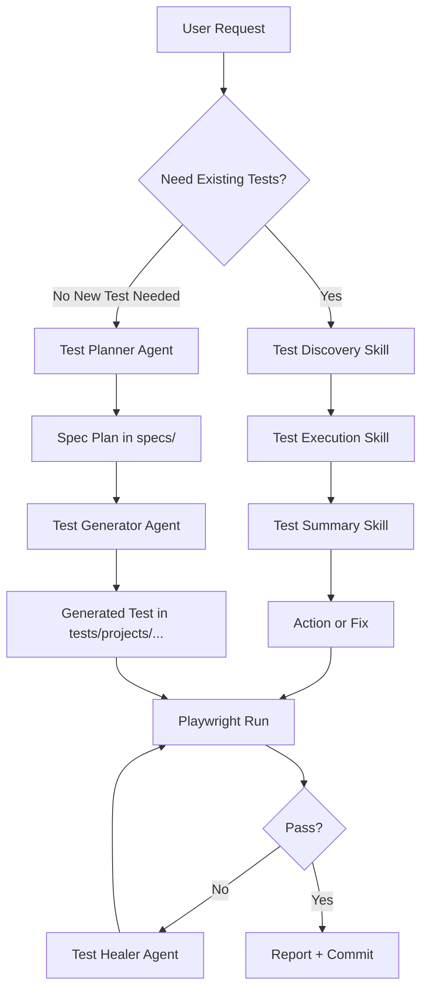

# AI Agent Framework

This folder is the canonical home for all agent assets in this repository.

## Folder Structure

- `agents/`: agent mode definitions (`*.agent.md`)
- `prompts/`: reusable prompt entrypoints (`*.prompt.md`)
- `skills/`: domain skills (`*/SKILL.md`)
- `test_generator/`: code-based generator module and prompt
- `failure_analyzer/`: failure categorization design notes
- `self_healing/`: locator/wait healing design notes
- `coverage_analyzer/`: requirement coverage analysis notes

## Repository Path Convention

- Use repo-relative paths (for example `tests/projects/student-loan-refi/...`).
- Do not use leading slash paths like `/tests/...` or `/test-data/...` in prompts, skills, or docs.
- Keep project data in `test-data/<project>/` and project specs in `tests/projects/<project>/`.

## Framework Flow

## How To Use Agents

1. Start with an orchestrator or planner request.
2. Keep runs narrow first (single file, single browser).
3. Expand scope only after a stable green run.
4. Save generated tests under `tests/projects/<project>/generated/`.

## Mobile Test Generation Workflow

- Review-first mobile test case files live in `ai/tests/mobile/`.
- Use prompt `ai/jobs/prompts/generate-mobile-test-cases.prompt.md`.
- The dedicated agent is `ai/jobs/agents/mobile-test-generator.agent.md`.

Two-phase execution:

1. `plan`: generate or refine one `.md` test case per file in `ai/tests/mobile/` targeting the mobile auth and onboarding controls.
2. `implement`: generate `.ts` WDIO specs from approved `.md` files into `mobile/tests/android/generated/`.

## How To Write A Skill

Create `ai/agents/skills/<skill-name>/SKILL.md` with:

- YAML frontmatter: `name`, `description`, `argument-hint`
- `When to Use`
- `Inputs`
- `Procedure` (short ordered steps)
- `Output Contract` (what the assistant should return)
- `Guardrails`

Use [ai/agents/skills/SKILL_TEMPLATE.md](ai/agents/skills/SKILL_TEMPLATE.md) as a starting point.

## How To Write A Prompt

Create `ai/agents/prompts/<prompt-name>.prompt.md` with:

- YAML frontmatter: `name`, `description`, `argument-hint`, `agent`
- Clear `Inputs` and `Expected Output`
- Explicit constraints and failure behavior

Use [ai/agents/prompts/PROMPT_TEMPLATE.md](ai/agents/prompts/PROMPT_TEMPLATE.md).

## How To Write An Agent

Create `ai/agents/agents/<agent-name>.agent.md` with:

- YAML frontmatter including tools and model
- Mission and workflow phases
- Strict boundaries (what not to do)

Use [ai/agents/agents/AGENT_TEMPLATE.md](ai/agents/agents/AGENT_TEMPLATE.md).
