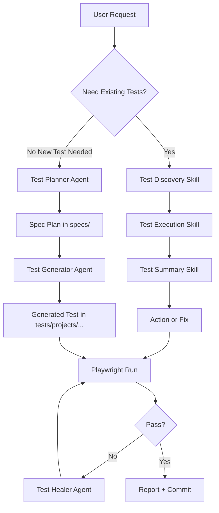

# AI Agent Framework

This folder is the canonical home for all agent assets in this repository.

## Folder Structure

- `agents/`: Copilot agent definitions (`*.agent.md`)
  - `playwright_agents/`: core web agents (`playwright-test-orchestrator`, `playwright-test-planner`, `playwright-test-generator`, `playwright-test-healer`)
  - `mobile-test-generator.agent.md`: dedicated mobile test generator agent
- `prompts/`: reusable prompt entrypoints (`*.prompt.md`)
- `skills/`: QA skills directory (`*/SKILL.md`)
  - `playwright-framework-context/`: Web E2E architecture & conventions
  - `api-testing/`: Postman auto-extraction, contract testing & schema validation
  - `mobile-testing/`: Android/iOS Appium/WDIO, build routing & OTP verification
  - `test-data-engineer/`: Compliant test data, password rules & domain tagging
  - `test-plan-generation/`: Requirement & story to test specification workflow
  - `bug-report-writing/`: RCA, failure classification & Jira bug reporting
  - `visual-regression-testing/`: Screenshot baselines, dynamic element masking & diff comparison
  - `accessibility-testing/`: Automated WCAG 2.1 A/AA auditing with `axe-core`
  - `performance-testing/`: Web Vitals metrics, SLA verification & k6 load scenarios
  - `flaky-test-management/`: Flaky test detection, isolation, memory tracking & auto-healing
  - `test-discovery/`: Spec discovery & narrowing
  - `test-execution/`: Focused execution runner
  - `test-summary/`: Test output diagnosis & triage

## Repository Path Convention

- Use repo-relative paths (for example `tests/projects/student-loan-refi/...`).
- Do not use leading slash paths like `/tests/...` or `/test-data/...` in prompts, skills, or docs.
- Keep project data in `test-data/<project>/` and project specs in `tests/projects/<project>/`.

## Framework Flow

```mermaid
flowchart TD
  A[User Request] --> B{Need Existing Tests?}
  B -->|Yes| C[Test Discovery Skill]
  C --> D[Test Execution Skill]
  D --> E[Test Summary Skill]
  E --> F[Action or Fix]

  B -->|No New Test Needed| G[Test Planner Agent]
  G --> H[Spec Plan in specs/]
  H --> I[Test Generator Agent]
  I --> J[Generated Test in tests/projects/...]

  F --> K[Playwright Run]
  J --> K
  K --> L{Pass?}
  L -->|No| M[Test Healer Agent]
  M --> K
  L -->|Yes| N[Report + Commit]
```

## How To Use Agents

1. Start with an orchestrator or planner request.
2. Keep runs narrow first (single file, single browser).
3. Expand scope only after a stable green run.
4. Save generated tests under `tests/projects/<project>/generated/`.

## Mobile Test Generation Workflow

- Review-first mobile test case files live in `ai/tests/mobile/`.
- Use prompt `ai/jobs/prompts/generate-mobile-test-cases.prompt.md`.
- The dedicated agent is `ai/jobs/agents/mobile-test-generator.agent.md`.

Two-phase execution:

1. `plan`: generate or refine one `.md` test case per file in `ai/tests/mobile/`.
2. `implement`: generate `.ts` WDIO specs from approved `.md` files into `mobile/tests/android/generated/`.

## How To Write A Skill

Create `ai/jobs/skills/<skill-name>/SKILL.md` with:

- YAML frontmatter: `name`, `description`, `argument-hint`
- `When to Use`
- `Inputs`
- `Procedure` (short ordered steps)
- `Output Contract` (what the assistant should return)
- `Guardrails`

Use [ai/jobs/skills/SKILL_TEMPLATE.md](ai/jobs/skills/SKILL_TEMPLATE.md) as a starting point.

## How To Write A Prompt

Create `ai/jobs/prompts/<prompt-name>.prompt.md` with:

- YAML frontmatter: `name`, `description`, `argument-hint`, `agent`
- Clear `Inputs` and `Expected Output`
- Explicit constraints and failure behavior

Use [ai/jobs/prompts/PROMPT_TEMPLATE.md](ai/jobs/prompts/PROMPT_TEMPLATE.md).

## How To Write An Agent

Create `ai/jobs/agents/<agent-name>.agent.md` with:

- YAML frontmatter including tools and model
- Mission and workflow phases
- Strict boundaries (what not to do)

## Related Guides

- [Root framework guide](../../readme.md)
- [API how-to guide](../../api/README.md)

Use [ai/jobs/agents/AGENT_TEMPLATE.md](ai/jobs/agents/AGENT_TEMPLATE.md).
