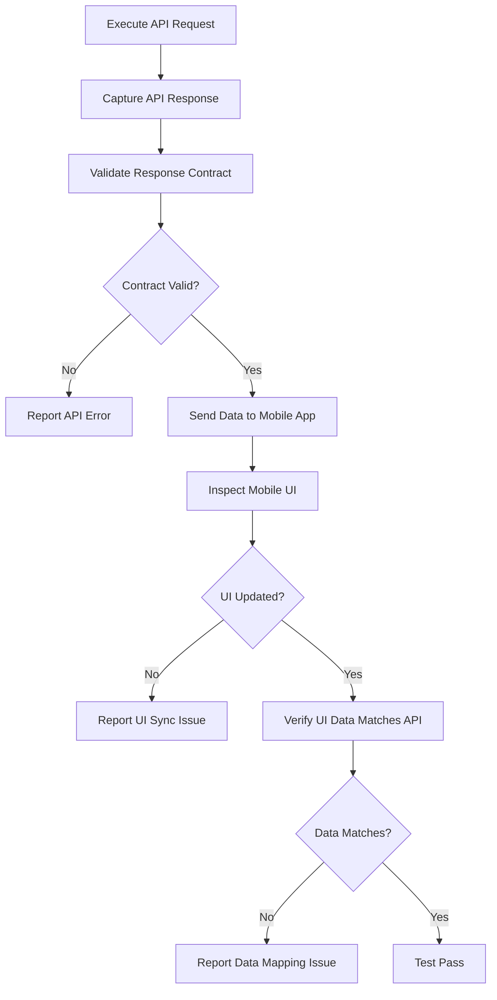

# API-to-Mobile UI Verification Guide

This guide explains how to verify API responses are correctly reflected in the mobile application UI. It covers both automated and manual verification strategies.

## Overview

API responses drive the mobile application's user interface. When testing APIs, you must verify that:
1. The API returns the correct data structure and values
2. The mobile app receives and parses the response correctly
3. The UI reflects the data accurately and updates appropriately

## Verification Workflow



## Core Verification Categories

### 1. Authentication & Token Flow

**API Endpoints:**
- `POST /api/oauth/token` → Access Token
- `POST /api/auth/logout` → Session Clear
- `POST /api/auth/refresh-token` → Token Renewal

**Mobile UI Verification Steps:**

1. **Token Storage Verification**
   - Execute: `POST /api/oauth/token`
   - Capture: `accessToken` from response
   - Mobile Step: Inspect app's local storage/keychain
   - Expected: Token stored securely (not in plaintext)
   - Verification: Token appears in subsequent API requests

2. **Session Management Verification**
   - Execute: `POST /api/auth/logout`
   - Mobile Step: Observe screen transition
   - Expected: Redirect to login screen, UI clears user data
   - Verification: Token removed from storage, session ended

3. **Automatic Token Injection**
   - After token fetch, subsequent API calls should include Authorization header
   - Mobile Step: Monitor network traffic in DevTools
   - Expected: `Authorization: Bearer <token>` in all authenticated requests
   - Verification: No "Unauthorized" errors in app

**Mobile Code Pattern:**
```typescript
// After API returns token, store it
const token = response.data.fetchOktaToken.accessToken;
localStorage.setItem('accessToken', token);

// Use token in subsequent requests
const headers = {
  'Authorization': `Bearer ${localStorage.getItem('accessToken')}`
};
```

**UI Indicators:**
- ✅ Login screen disappears, home/dashboard appears
- ✅ User account menu shows logged-in user
- ✅ No "session expired" errors appear

---

### 2. User Profile & Account Data

**API Endpoints:**
- `GET /api/users/{userId}` → User Profile
- `GET /api/users/{userId}/accounts` → Account List
- `GET /api/accounts/{accountId}` → Account Details

**Mobile UI Verification Steps:**

1. **Profile Data Display**
   - Execute: `GET /api/users/{userId}`
   - Capture Response:
     ```json
     {
       "userId": "12345",
       "firstName": "John",
       "lastName": "Doe",
       "email": "john@example.com",
       "phone": "555-1234",
       "avatar": "https://..."
     }
     ```
   - Mobile Step: Navigate to Profile/Settings screen
   - Expected UI:
     - Name displays as "John Doe"
     - Email shows "john@example.com"
     - Avatar image loads from provided URL
   - Verification: Compare API response fields to UI display

2. **Account List Population**
   - Execute: `GET /api/users/{userId}/accounts`
   - Capture Response:
     ```json
     {
       "accounts": [
         { "accountId": "ACC001", "accountName": "Checking", "balance": 2500.00 },
         { "accountId": "ACC002", "accountName": "Savings", "balance": 10000.00 }
       ]
     }
     ```
   - Mobile Step: View Accounts screen/list
   - Expected UI:
     - 2 accounts displayed
     - Account names match API response
     - Balances display correctly
   - Verification: Row-by-row comparison of API data to UI list items

3. **Account Details Screen**
   - Execute: `GET /api/accounts/{accountId}`
   - Capture Response with account type, status, features
   - Mobile Step: Tap on account to view details
   - Expected UI: All account fields populate
   - Verification: 
     - Account type badge/label matches API response
     - Status indicator reflects API status field
     - Interest rate displays if provided
     - Account number (masked) matches API

**Inspection Technique:**

```typescript
// In mobile app test
async function verifyProfileSync() {
  // Get API response
  const profileResponse = await getProfile();
  
  // Get UI values
  const displayedName = await page.getByTestId('profile-name').textContent();
  const displayedEmail = await page.getByTestId('profile-email').textContent();
  
  // Verify match
  expect(displayedName).toBe(`${profileResponse.firstName} ${profileResponse.lastName}`);
  expect(displayedEmail).toBe(profileResponse.email);
}
```

**UI Indicators:**
- ✅ All account names visible
- ✅ Balances format consistently (currency)
- ✅ No placeholder/loading text remains
- ✅ Images load (no broken image icons)
- ✅ Status badges show correct colors/icons

---

### 3. Transaction & Activity Data

**API Endpoints:**
- `GET /api/accounts/{accountId}/transactions` → Transaction History
- `GET /api/users/{userId}/notifications` → Notification List

**Mobile UI Verification Steps:**

1. **Transaction List Loading**
   - Execute: `GET /api/accounts/{accountId}/transactions?limit=20`
   - Capture Response:
     ```json
     {
       "transactions": [
         {
           "transactionId": "TXN001",
           "date": "2026-08-06",
           "description": "Transfer to Savings",
           "amount": 500.00,
           "type": "transfer",
           "status": "completed"
         }
       ]
     }
     ```
   - Mobile Step: Open Transactions/Activity view
   - Expected UI:
     - Transactions sorted by date (newest first)
     - Each transaction shows: date, description, amount
     - Amount formatted as currency
     - Status badge indicates completion
   - Verification: 
     - Row count matches API response count
     - Amount values match API (watch for currency conversion)
     - Dates are properly formatted and sorted

2. **Notification Display**
   - Execute: `GET /api/users/{userId}/notifications`
   - Capture Response with notification type, message, date
   - Mobile Step: Open Notifications/Message Center
   - Expected UI:
     - All notifications appear
     - Unread count badge matches API `unreadCount`
     - Notification order matches API order
   - Verification:
     - Visual indicator for unread status
     - Tap notification → detail view shows full message
     - Notification timestamp matches API

**Performance Verification:**
- Response time < 2 seconds
- List renders smoothly with pagination
- Lazy-loading: more items load on scroll

**UI Indicators:**
- ✅ Transaction count matches API
- ✅ Dates display in user's timezone
- ✅ Amounts show correct currency symbol
- ✅ Transaction status reflected with icon/color
- ✅ No duplicate transactions
- ✅ Oldest transactions appear if paginated

---

### 4. Loan Application & Status

**API Endpoints:**
- `POST /api/loans/apply` → Submit Application
- `GET /api/applications/{applicationId}/status` → Application Status
- `GET /api/loans/offers` → Loan Offers List

**Mobile UI Verification Steps:**

1. **Application Submission Response**
   - Execute: `POST /api/loans/apply`
   - Capture Response:
     ```json
     {
       "applicationId": "APP123456",
       "status": "submitted",
       "confirmationNumber": "CONF-789123",
       "message": "Application submitted successfully"
     }
     ```
   - Mobile Step: Complete application form and submit
   - Expected UI:
     - Success screen displays confirmation number
     - Application ID shown for reference
     - Next action/button appears (e.g., "View Status")
   - Verification:
     - Confirmation number matches API response
     - Application ID stored for tracking
     - No error messages present

2. **Application Status Updates**
   - Execute: `GET /api/applications/{applicationId}/status`
   - Capture Response:
     ```json
     {
       "status": "under_review",
       "progress": 60,
       "lastUpdated": "2026-08-06T10:00:00Z",
       "nextSteps": [
         "Review credit report",
         "Verify employment"
       ]
     }
     ```
   - Mobile Step: Navigate to Application Status screen
   - Expected UI:
     - Progress bar shows 60% completion
     - Status badge shows "Under Review"
     - Next steps listed
     - Last updated time displayed
   - Verification:
     - Progress bar position matches API progress value
     - Status label matches API status (converted to display format)
     - Next steps order matches API

3. **Loan Offers List**
   - Execute: `GET /api/loans/offers`
   - Capture Response:
     ```json
     {
       "offers": [
         {
           "offerId": "OFFER001",
           "loanAmount": 250000,
           "rate": 5.25,
           "term": 30,
           "monthlyPayment": 1384
         }
       ]
     }
     ```
   - Mobile Step: View Offers screen
   - Expected UI:
     - Offers displayed in card/list format
     - Each offer shows: amount, rate, term, payment
     - Selected offer highlighted
   - Verification:
     - Loan amount formatted with commas
     - Interest rate shows 2 decimals
     - Monthly payment calculated correctly

**Mobile Code Pattern:**
```typescript
async function verifyApplicationStatusUI() {
  // Get API response
  const statusResponse = await getApplicationStatus(appId);
  
  // Get UI values
  const progressBar = await page.getByTestId('progress-bar');
  const progressPercent = await progressBar.evaluate(el => 
    parseInt(el.getAttribute('aria-valuenow'))
  );
  
  const statusBadge = await page.getByTestId('status-badge').textContent();
  
  // Verify
  expect(progressPercent).toBe(statusResponse.progress);
  expect(statusBadge).toContain(statusResponse.status.replace('_', ' '));
}
```

**UI Indicators:**
- ✅ Progress bar animates to correct percentage
- ✅ Status changes reflect without page reload
- ✅ Loan calculations accurate (rate, term, payment)
- ✅ No stale data displayed

---

### 5. Document Upload & Management

**API Endpoints:**
- `POST /api/documents/upload` → Upload Document
- `GET /api/documents/{applicationId}` → Document List
- `DELETE /api/documents/{documentId}` → Delete Document

**Mobile UI Verification Steps:**

1. **Upload Success Response**
   - Execute: `POST /api/documents/upload`
   - Capture Response:
     ```json
     {
       "documentId": "DOC123",
       "fileName": "pay_stub.pdf",
       "documentType": "income_verification",
       "uploadedAt": "2026-08-06T10:30:00Z",
       "status": "pending_review"
     }
     ```
   - Mobile Step: Select and upload document
   - Expected UI:
     - Success toast/notification appears
     - Document added to list
     - Status shows "Pending Review"
     - File name displays correctly
   - Verification:
     - Document ID available for tracking
     - Upload timestamp recorded
     - File appears with correct icon (PDF, image, etc.)

2. **Document List Display**
   - Execute: `GET /api/documents/{applicationId}`
   - Capture Response:
     ```json
     {
       "documents": [
         {
           "documentId": "DOC123",
           "fileName": "pay_stub.pdf",
           "documentType": "income_verification",
           "status": "approved",
           "uploadedAt": "2026-08-06T10:30:00Z"
         }
       ]
     }
     ```
   - Mobile Step: View Documents section
   - Expected UI:
     - All documents listed
     - Each shows: file name, type, status, upload date
     - Status badge color indicates approval state
   - Verification:
     - Document count matches API
     - Status badges match API status
     - Dates formatted correctly

3. **Document Preview**
   - Execute: Document already uploaded (API lists it)
   - Mobile Step: Tap document to preview
   - Expected UI:
     - Document renders/downloads
     - File can be viewed or shared
   - Verification:
     - Correct document opens (by documentId)
     - No "File not found" errors

**UI Indicators:**
- ✅ Upload progress bar shows
- ✅ Success message displays
- ✅ Document appears in list immediately
- ✅ File icons display correctly
- ✅ Status badges color-coded (green=approved, yellow=pending, red=rejected)
- ✅ Timestamps in user-friendly format (e.g., "2 hours ago")

---

### 6. Form Data & Input Validation

**API Endpoints:**
- `PUT /api/users/{userId}` → Update Profile
- `POST /api/applications/{applicationId}/co-applicant` → Add Co-Applicant

**Mobile UI Verification Steps:**

1. **Form Submission & Response**
   - Execute: `PUT /api/users/{userId}`
   - Capture Response:
     ```json
     {
       "userId": "12345",
       "firstName": "Jane",
       "lastName": "Smith",
       "updated": true,
       "message": "Profile updated successfully"
     }
     ```
   - Mobile Step: Fill form and submit
   - Expected UI:
     - Loading state shown during submission
     - Success message displays
     - Form fields update to show new values
     - Screen navigates away or form resets
   - Verification:
     - Submitted data matches form input
     - Response confirms all fields updated
     - No validation errors appear

2. **Error Handling**
   - Execute: `PUT /api/users/{userId}` with invalid data
   - Capture Error Response:
     ```json
     {
       "error": "validation_error",
       "fields": {
         "email": "Invalid email format"
       }
     }
     ```
   - Mobile Step: Submit form with invalid data
   - Expected UI:
     - Error message displays under email field
     - Form doesn't submit
     - User can correct and retry
   - Verification:
     - Error message matches API error
     - Specific field highlighted
     - Form remains accessible for correction

**Mobile Code Pattern:**
```typescript
async function verifyFormDataSync() {
  // Fill and submit form
  await page.getByTestId('first-name').fill('Jane');
  await page.getByTestId('form-submit').click();
  
  // Get API response
  const updateResponse = await captureApiCall('PUT', '/api/users');
  
  // Verify UI updated
  const displayedName = await page.getByTestId('profile-first-name').textContent();
  expect(displayedName).toBe(updateResponse.firstName);
  
  // Verify success message
  const successMsg = await page.getByTestId('success-message');
  expect(successMsg).toBeVisible();
}
```

**UI Indicators:**
- ✅ Loading spinner appears during request
- ✅ Success notification displays
- ✅ Form fields update with new values
- ✅ Validation errors show inline
- ✅ Submit button disabled during request
- ✅ No duplicate submissions

---

## Network Inspection Techniques

### Using Playwright DevTools

```typescript
// Capture and inspect network requests
const [response] = await Promise.all([
  page.waitForResponse(r => r.url().includes('/api/accounts')),
  page.click('[data-testid="view-accounts"]')
]);

const jsonData = await response.json();
console.log('API Response:', jsonData);

// Verify response in UI
const accountNames = await page.locator('[data-testid="account-name"]').allTextContents();
console.log('UI Account Names:', accountNames);
```

### Using Mobile Network Proxy (Android/iOS)

1. **Android Device:**
   ```bash
   # Set up Charles/Burp proxy
   adb shell settings put global http_proxy <proxy-ip>:<port>
   
   # View requests in UI
   # Tap account → network shows GET /api/accounts
   ```

2. **iOS Device:**
   ```
   Settings → Wi-Fi → Configure Proxy
   Select Manual, enter proxy details
   Verify requests in proxy tool
   ```

### Automated Network Validation

```typescript
async function validateApiDataInUI(apiEndpoint, uiSelector) {
  // Capture network request
  const response = await page.waitForResponse(
    r => r.url().includes(apiEndpoint)
  );
  const apiData = await response.json();
  
  // Get UI data
  const uiElements = await page.locator(uiSelector).allTextContents();
  
  // Validate each field
  apiData.forEach((item, index) => {
    expect(uiElements[index]).toContain(item.displayName);
  });
}
```

---

## Data Formatting & Transformation

### Common Transformations to Verify

| API Field | API Format | UI Format | Verification |
|-----------|-----------|-----------|--------------|
| `amount` | `2500.00` | `$2,500.00` | Currency formatting, comma separator |
| `date` | `2026-08-06T10:30:00Z` | `Aug 6, 2026 10:30 AM` | Timezone conversion, locale formatting |
| `status` | `under_review` | `Under Review` | Title case, spacing |
| `rate` | `5.25` | `5.25%` | Percentage sign added |
| `phone` | `5551234567` | `(555) 123-4567` | Phone formatting |
| `imageUrl` | Full URL | Rendered image | Image loads from URL |
| `boolean` | `true/false` | Toggle switch, checkmark | Visual representation |

### Validation Code:

```typescript
async function validateDataFormatting() {
  const apiAmount = 2500.00;
  const uiAmount = await page.getByTestId('display-amount').textContent();
  
  // Verify formatting
  expect(uiAmount).toBe('$2,500.00');
  
  const apiDate = '2026-08-06T10:30:00Z';
  const uiDate = await page.getByTestId('display-date').textContent();
  
  // Parse and verify format
  const parsedDate = new Date(apiDate);
  expect(uiDate).toContain(parsedDate.toLocaleDateString());
}
```

---

## Common Issues & Debugging

### Issue 1: Data Not Appearing in UI

```
Symptom: API returns data, but UI shows empty/loading
Fix: 
1. Check response status code (200, 201, etc.)
2. Verify API URL used in app matches request
3. Check for parsing errors in console
4. Verify JWT token is current (not expired)
5. Check CORS headers if cross-origin
```

### Issue 2: Partial Data Display

```
Symptom: Some fields appear, others are blank
Fix:
1. Compare API response to UI fields
2. Check if field is optional in API
3. Verify mobile app has UI element for that field
4. Check for null/undefined handling
5. Look for field name mapping errors
```

### Issue 3: Data Mismatch

```
Symptom: Data appears but values are wrong
Fix:
1. Verify API returns correct data
2. Check for data transformation (currency, date)
3. Verify field mappings in mobile code
4. Check for race conditions (stale data)
5. Verify API response freshness (not cached)
```

### Issue 4: UI Updates Slowly

```
Symptom: API response fast, but UI updates lag
Fix:
1. Check for rendering bottlenecks
2. Verify list virtualization (for long lists)
3. Check network timing (waterfall)
4. Monitor memory usage
5. Profile with DevTools/Profiler
```

### Debugging Checklist:

```typescript
async function debugApiUiSync() {
  // 1. Capture API response
  const apiResponse = await page.waitForResponse(r => r.url().includes('/api'));
  const apiStatus = apiResponse.status();
  const apiData = await apiResponse.json();
  console.log('API Status:', apiStatus, 'Data:', apiData);
  
  // 2. Wait for UI to update
  await page.waitForTimeout(1000); // Small buffer for rendering
  
  // 3. Get UI snapshot
  const screenshot = await page.screenshot();
  console.log('UI Screenshot:', screenshot);
  
  // 4. Check UI elements
  const elementCount = await page.locator('[data-item]').count();
  console.log('UI Items:', elementCount, 'API Items:', apiData.items.length);
  
  // 5. Get UI data
  const uiData = await page.locator('[data-item]').allTextContents();
  console.log('UI Data:', uiData);
  
  // 6. Compare
  if (elementCount !== apiData.items.length) {
    console.error('MISMATCH: UI has', elementCount, 'API has', apiData.items.length);
  }
}
```

---

## Test Automation Integration

### Pattern 1: Intercept & Mock

```typescript
async function testWithMockedData() {
  // Mock API response
  await page.route('**/api/accounts', route => {
    route.abort('blockedbyclient');
    // Or use: route.fulfill({ body: JSON.stringify(mockData) })
  });
  
  // UI should show error
  await page.click('[data-testid="load-accounts"]');
  const errorMsg = await page.getByTestId('error-message');
  expect(errorMsg).toBeVisible();
}
```

### Pattern 2: Monitor & Verify

```typescript
async function testWithNetworkMonitoring() {
  const requests: any[] = [];
  
  page.on('response', async (response) => {
    if (response.url().includes('/api')) {
      requests.push({
        url: response.url(),
        status: response.status(),
        data: await response.json()
      });
    }
  });
  
  // Perform action
  await page.click('[data-testid="sync-data"]');
  
  // Verify both API and UI
  expect(requests.length).toBeGreaterThan(0);
  const lastRequest = requests[requests.length - 1];
  expect(lastRequest.status).toBe(200);
  
  // Check UI updated
  const uiData = await page.getByTestId('display-value').textContent();
  expect(uiData).toContain(lastRequest.data.value);
}
```

### Pattern 3: End-to-End Verification

```typescript
async function verifyFullApiToUiFlow() {
  // Step 1: Trigger API call
  await page.click('[data-testid="refresh-button"]');
  
  // Step 2: Intercept API response
  const apiResponse = await page.waitForResponse(
    r => r.url().includes('/api/accounts') && r.status() === 200
  );
  const apiData = await apiResponse.json();
  
  // Step 3: Wait for UI to render
  await page.waitForSelector('[data-testid="account-list"] > [data-item]');
  
  // Step 4: Verify count
  const itemCount = await page.locator('[data-item]').count();
  expect(itemCount).toBe(apiData.accounts.length);
  
  // Step 5: Verify each item
  for (let i = 0; i < apiData.accounts.length; i++) {
    const account = apiData.accounts[i];
    const uiText = await page.locator('[data-item]').nth(i).textContent();
    expect(uiText).toContain(account.accountName);
  }
}
```

---

## Best Practices

✅ **DO:**
- Always capture full API response before verifying UI
- Use explicit waits for UI updates, not fixed timeouts
- Verify data types (not just values)
- Check for edge cases (empty lists, null values, special characters)
- Test both success and error paths
- Verify loading states and animations
- Test with actual API data, not just mock data
- Document expected transformations (currency, date)
- Use network interception to detect missing/extra requests
- Verify performance (response time < 2s expected)

❌ **DON'T:**
- Assume UI is updated after API call (wait explicitly)
- Compare raw API data to UI without accounting for formatting
- Ignore error responses
- Test only the happy path
- Skip null/undefined checks
- Hardcode expected values (use API response)
- Ignore timezone differences
- Skip cache validation
- Test UI without verifying backend
- Mix UI tests with API tests (run separately, verify integration)

---

## Test Execution Strategy

### Phase 1: API Contract Validation
```bash
# Verify APIs return correct structure
npm run test:api:contract
```

### Phase 2: Mobile UI Population
```bash
# Verify UI displays API data
npm run test:mobile:create-user
```

### Phase 3: End-to-End Integration
```bash
# Verify full flow from API to UI
npm run test:api:integration:mobile
```

### Phase 4: Performance
```bash
# Verify response times and rendering
npm run test:api:performance
```

---

## CI/CD Integration

```yaml
# GitHub Actions example
- name: Verify API to UI Sync
  run: |
    # Run API tests
    npm run test:api:smoke
    
    # Capture API responses
    npm run test:api:capture-responses
    
    # Run mobile tests
    npm run test:mobile:smoke:api-validation
    
    # Compare results
    npm run verify:api-ui-sync
```

---

## Further Reading

- [API-TESTING.md](./API-TESTING.md) - Complete API testing guide
- [README.md](./README.md) - API testing quick start
- [tests/TEST-CASES-REFERENCE.md](./tests/TEST-CASES-REFERENCE.md) - All 50 test cases
- [tests/test-cases.csv](./tests/test-cases.csv) - Test cases in CSV format
- [../mobile/README.md](../mobile/README.md) - Mobile testing setup
