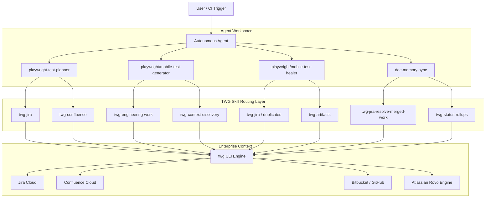
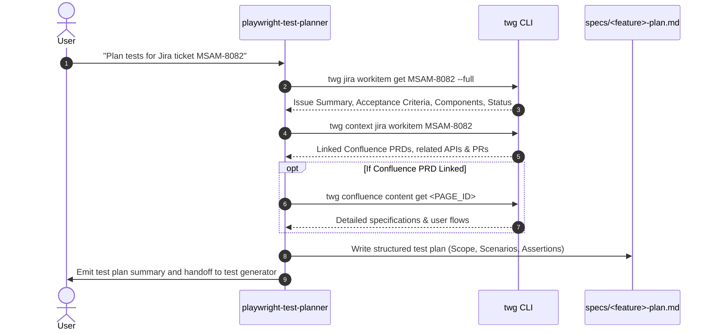
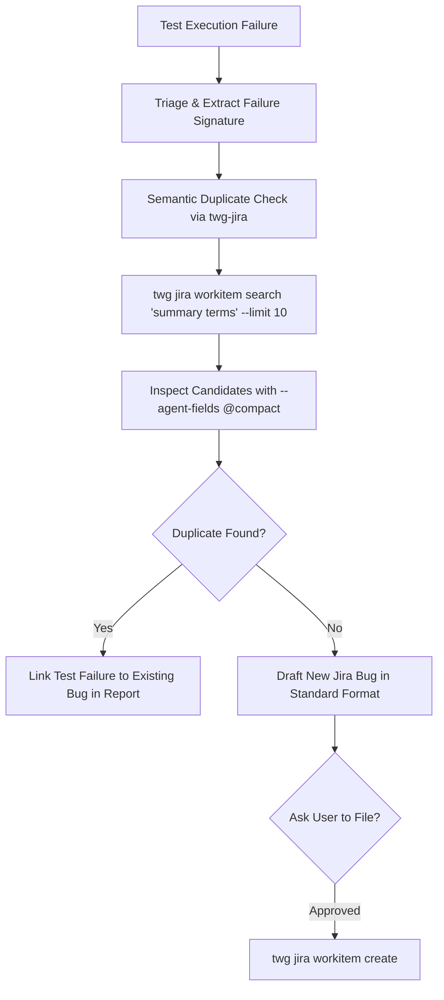

# Using TWG Jira & Atlassian Skills with AI Agents

A comprehensive operating guide for integrating The Work Graph (TWG) and Atlassian intelligence skills with the autonomous agents and testing workflows in this repository.

---

## 1. Executive Summary & Architecture

The **TWG (The Work Graph) Agent Skills Suite** bridges autonomous agents with Atlassian and enterprise engineering context across Jira, Confluence, Bitbucket/GitHub, Rovo, and Assets (CMDB).

In this workspace, agents previously had to rely on manual user prompts, local files, or raw REST scripts to understand Jira tickets, acceptance criteria, and PR histories. With the TWG suite located in [ai/jobs/skills/jira twg](ai/jobs/skills/jira twg), agents can:
1. **Fetch authoritative requirements directly** from Jira tickets and Confluence PRDs before writing tests.
2. **Perform semantic duplicate bug detection** to prevent creating duplicate defects when tests fail.
3. **Trace code changes, pull requests, and commit diffs** to ground assertions in actual developer implementation.
4. **Publish test execution reports and summaries** as discoverable Atlassian Artifacts.
5. **Reconcile completed automation work** with Jira backlog items and sprint boards safely via dry-run plans.

### System Architecture Flow



---

## 2. Complete Skills Inventory & Routing Matrix

The skills are located in [ai/jobs/skills/jira twg](ai/jobs/skills/jira twg). When an agent needs Atlassian or enterprise context, it must route to the narrowest companion skill rather than calling generic searches.

| Skill | Primary Focus & Capabilities | Key CLI Commands | Primary Agent Consumers |
| :--- | :--- | :--- | :--- |
| **`twg`** | Umbrella orchestrator, command discovery, live help, batching engine. | `twg help <terms>`<br>`twg help describe "<path>"`<br>`twg help discover-skills "<intent>"` | All Agents (Root entrypoint) |
| **`twg-jira`** | Workitem reads, JQL queries, field metadata, workflow transitions, remote links, comments, duplicate detection. | `twg jira workitem get <KEY> [--full\|--comments]`<br>`twg jira workitem query --jql "<JQL>"`<br>`twg jira workitem field update-metadata --id <KEY>`<br>`twg jira workitem transition --id <KEY> -o json` | `playwright-test-planner`<br>`playwright-test-healer`<br>`bug-report-writing` |
| **`twg-context-discovery`** | Dependency graphs, related PRs, documentation, project-to-repo maps, OOO catch-up. | `twg context jira workitem <KEY>`<br>`twg context project <KEY>` | `playwright-test-planner`<br>`mobile-test-orchestrator` |
| **`twg-engineering-work`** | Code search across indexed repos, PR status, reverse dependencies, issue-to-PR tracing. | `twg pull-requests query`<br>`twg pull-requests get <URL...>`<br>`twg search-code "<query>"` | `playwright-test-generator`<br>`mobile-test-generator` |
| **`twg-jira-resolve-merged-work`** | Reconciling stale Jira tickets with merged PRs and commits; dry-run plans first. | `twg jira sprint workitems query`<br>`twg bb pull-requests query` | `doc-memory-sync`<br>`playwright-test-orchestrator` |
| **`twg-code-review`** | Code review combining local diffs, PR metadata, and Jira requirements. | `twg help describe "skill:twg-code-review"` | Code Review Workflows |
| **`twg-agentic-search`** | Deep enterprise cross-surface search with Rovo (Jira, Confluence, Slack, Drive, Bitbucket, GitHub). | `twg rovo search "<query>" --agent-fields @compact`<br>`twg rovo list-apps -o json` | Research & Discovery |
| **`twg-confluence`** | Reading and updating Confluence PRDs, architecture pages, spaces, and CQL queries. | `twg confluence content get <PAGE_ID>`<br>`twg confluence search "<title>"` | `playwright-test-planner`<br>`test-plan-generation` |
| **`twg-status-rollups`** | Engineering velocity, sprint progress, launch & go/no-go readiness briefs. | `twg pr-tree`<br>`twg workitem-tree`<br>`twg work-tree` | QA Leads, Release Orchestrators |
| **`twg-responsibility-routing`** | Identifying declared owners, maintainers, SMEs, approvers, and escalation paths. | `twg responsibility get <ref>`<br>`twg responsibility infer <ref>` | QA Triage, Incident Escalation |
| **`twg-operational-health`** | Incidents, post-incident reviews (PIR), on-call handoffs, Assets/CMDB, golden signals. | `twg assets search`<br>`twg assets graph` | Production Triaging & Stability |
| **`twg-artifacts`** | Publishing standalone HTML test reports, test summaries, and docs as Atlassian Artifacts. | `twg artifacts file create <path> --access open --description "<desc>"` | Test Execution Reporters |
| **`twg-space-creation`** | Bootstrapping, designing, or cloning Confluence spaces from blueprints or codebases. | `twg confluence space create` | Documentation Scaffolding |
| **`twg-bench-lite`** | A/B benchmark evaluation comparing raw MCP vs TWG CLI graph context. | `node scripts/benchmark-lite/runner.mjs` | Benchmarking & Evaluation |

---

## 3. Agent Integration Playbooks

### Playbook 1: Jira-to-Test Plan Generation
**Agents**: `playwright-test-planner` & `test-plan-generation` skill  
**Objective**: Convert a Jira feature ticket (e.g., `MSAM-8082` or `FAL-3131`) into an executable Markdown test specification in `specs/`.



#### Step-by-Step Instructions:
1. **Hydrate Ticket Natively**:
   ```bash
   twg jira workitem get MSAM-8082 --full
   ```
   Do not guess fields. Extract summary, description, acceptance criteria, and component tags.
2. **Discover Linked Specifications**:
   ```bash
   twg context jira workitem MSAM-8082
   ```
   Find linked Confluence PRDs or design pages.
3. **Fetch PRD Content (if present)**:
   ```bash
   twg confluence content get <PRD_PAGE_ID>
   ```
4. **Draft the Test Specification**:
   Save to `specs/<project>-plan.md` using the standard format: Objective, Happy Path, Edge Cases, Boundary Validation, Error Handling, and Risk Matrix.

---

### Playbook 2: Test Implementation Grounded in Developer PRs
**Agents**: `playwright-test-generator` / `mobile-test-generator`  
**Objective**: Generate Playwright or WDIO specs with exact selectors, endpoints, and status assertions derived from developer code changes.

1. **Trace Issue to Merged/Open PRs**:
   ```bash
   twg pull-requests query --limit 5
   # Or search code directly for the Jira issue key
   twg search-code "MSAM-8082"
   ```
2. **Inspect Changed Files & Models**:
   Review the PR diff to identify exact payload schemas, UI element test IDs (`data-testid`), and API route changes.
3. **Generate Tests in Standard Workspace Paths**:
   - Web Playwright: `tests/projects/<project>/generated/<feature>.spec.ts`
   - Mobile Appium: `mobile/tests/android/generated/<feature>.spec.ts`
4. **Assert Checkpoints**:
   Each step must have explicit assertions as defined in [AGENTS.md](AGENTS.md).

---

### Playbook 3: Test Failure Triage & Duplicate Bug Detection
**Agents**: `playwright-test-healer`, `mobile-test-healer`, `bug-report-writing`  
**Objective**: When tests fail, diagnose root cause and check if an existing Jira bug already exists before filing a duplicate.



#### Rules for Duplicate Detection (from `twg-jira/references/duplicates.md`):
- **Read-Only Safety**: The duplicate detection phase is read-only. Never mutate Jira during detection.
- **Ignore Links & Comments**: Compare only summary, description, created time, component, and status. Do not rely on existing issue links as they bias independent comparison.
- **Search Command**:
  ```bash
  twg jira workitem search "Student IDR payment calculation mismatch" --limit 10
  ```
- **Inspect Candidates**:
  ```bash
  twg jira workitem get <CANDIDATE_KEY> --field summary,description,status,created
  ```
- **Standard Bug Report Formatting** (from `bug-report-writing`):
  Use `[SLF]` or `[FAL]` prefix, exact reproduction steps, environment, observed vs expected results, and trace file paths.

---

### Playbook 4: Automated Sprint Reconciliation & Cleanup
**Agents**: `doc-memory-sync` & Orchestrators  
**Objective**: Reconcile QA backlog tasks with merged test automation PRs.

1. **Identify Stale or Unresolved Automation Tickets**:
   ```bash
   twg jira workitem query --jql 'project = MSAM AND issuetype in (Task, "Sub-task") AND statusCategory != Done AND component = Automation'
   ```
2. **Run Dry-Run Resolution Plan** (from `twg-jira-resolve-merged-work`):
   Match candidate keys against merged Bitbucket/GitHub PR titles, branch names, and commit logs.
3. **Score Confidence**:
   - **High**: Exact key in merged PR title/branch, no open subtasks, valid transition exists.
   - **Medium**: Same assignee/repo with strong title similarity.
   - **Low**: Fuzzy title match only.
4. **Present Dry-Run Plan to User**:
   **Never** transition automatically without user approval. Output the dry-run table:
   | Key | Summary | Merged PR | Target Transition | Confidence |
   | :--- | :--- | :--- | :--- | :--- |
   | `MSAM-8100` | Add IDR calculator tests | PR #142 | `Done` | High |

---

### Playbook 5: Publishing Test Reports as Atlassian Artifacts
**Agents**: Test Runners & Orchestrators  
**Objective**: Share standalone HTML test reports (Playwright HTML report or WDIO consolidated reports) with team members as discoverable Atlassian Artifacts.

```bash
# Ensure HTML is self-contained with embedded assets
twg artifacts file create playwright-report/index.html \
  --access open \
  --description "Playwright E2E Regression Report - Student Loan Refinance"
```

#### Invariants for Artifacts (from `twg-artifacts`):
- **Self-Contained Files**: The HTML report must embed scripts and stylesheets; external relative imports like `./app.js` are not supported.
- **Access Level**:
  - `--access private`: Draft or unreviewed generated files.
  - `--access open`: Reviewed or final test execution reports for team visibility.
- **Accurate Descriptions**: The `--description` must accurately summarize the test run (e.g. suite name, pass/fail counts, environment).

---

### Playbook 6: Release Go/No-Go Readiness Assessment
**Agents**: `playwright-test-orchestrator` & `twg-status-rollups`  
**Objective**: Evaluate if a release branch or project is ready for deployment based on active Jira defects and PR momentum.

1. **Query PR Movement & Momentum**:
   ```bash
   twg pr-tree --since 14d
   ```
2. **Query Unresolved Defect Load**:
   ```bash
   twg jira workitem query --jql 'project = MSAM AND issuetype = Bug AND statusCategory != Done ORDER BY priority DESC'
   ```
3. **Synthesize Readiness Brief**:
   Combine test automation pass rates from `test-results/` with Jira open blocker counts and PR merge volume to render a definitive go/no-go recommendation.

---

## 4. Autonomy Tiers & Pre-Authorized Boundaries

To prevent unauthorized changes while eliminating human bottlenecks, all TWG actions must adhere to the Autonomy Tiers defined in [AGENTS.md](AGENTS.md):

| Autonomy Tier | Scope | Allowed TWG Autonomous Actions | When Agent MUST Ask User |
| :--- | :--- | :--- | :--- |
| **Tier 0**<br>(Read & Diagnose) | Read-Only | - `twg jira workitem get`<br>- `twg jira workitem query`<br>- `twg rovo search`<br>- `twg context`<br>- `twg pr-tree`<br>- `twg search-code` | **Never ask.** Proceed autonomously to gather all required facts. |
| **Tier 1**<br>(Additive Planning) | Non-destructive proposals | - Generate Markdown test plans in `specs/`<br>- Generate dry-run Jira cleanup plans<br>- Draft Jira bug report Markdown in memory | Only if the requirement contradicts documented business logic. |
| **Tier 2**<br>(Safe Operations) | Verified low-impact writes | - Discover field & transition metadata (`field update-metadata`)<br>- Add issue remote links (`jira workitem link`)<br>- Add non-destructive internal comments<br>- Publish test reports (`twg artifacts file create`) | If a remote link target is ambiguous or metadata fails validation. |
| **Tier 3**<br>(Critical / Mutations) | Workflow state changes & deletions | - Transitioning Jira status (e.g. to `Done`, `Closed`, `Won't Do`)<br>- Modifying locked custom fields<br>- Deleting issues or links<br>- Posting public PR reviews | **Always ask user before executing.** Show the exact planned change first. |

---

## 5. Token Economics & Batching Rules

Calling the TWG CLI repeatedly in small increments causes extreme token bloat because each call re-submits conversation context. Follow these mandatory token optimization rules:

### Rule 1: Never Loop `get` Across Individual Keys
❌ **Costly Anti-Pattern (5-10x token consumption)**:
```bash
twg jira workitem get MSAM-8081
twg jira workitem get MSAM-8082
twg jira workitem get MSAM-8083
```
✅ **Batched Pattern (1 call)**:
```bash
twg jira workitem get MSAM-8081 MSAM-8082 MSAM-8083 --agent-fields @compact
```

### Rule 2: Use Projection Flags
- Use `--agent-fields @compact` for shortlisting candidates (keys, summary, status).
- Use `--agent-fields @evidence` when snippets, URLs, and provenance are needed.
- In JQL queries, restrict fields:
  ```bash
  twg jira workitem query --jql "project = MSAM AND status = Open" --fields summary,status,priority,assignee
  ```

### Rule 3: The 5-Call Circuit Breaker
If an agent issues 5 consecutive calls to the same subcommand without resolving the entity, it **must halt**, re-evaluate the anchor, and change the query strategy.

---

## 6. CLI Execution & Environment Fallback Mechanics

The TWG CLI is installed at `/Users/jameshc/.local/bin/twg` on macOS.

### Execution Safeguards
1. **PATH Resolution**:
   If `twg` is not recognized in the shell, use the explicit binary path:
   - macOS / Linux: `$HOME/.local/bin/twg`
   - Windows PowerShell: `$env:LOCALAPPDATA\Programs\twg\bin\twg.exe`
2. **Live Command Discovery**:
   When the arguments or flags for a command are uncertain, run live help before guessing:
   ```bash
   twg help describe "jira workitem transition"
   twg help describe "rovo search"
   ```
3. **Safe Transition Discovery**:
   Transitions cannot be guessed. Always discover valid transitions before executing:
   ```bash
   # Read-only discovery of available transitions
   twg jira workitem transition --id MSAM-8082 -o json
   ```
   Inspect the returned transition IDs and required screen fields before making a mutation.
4. **Auth & Sandbox Guard**:
   Never attempt to run login, config, or credential-altering commands. If auth expires, report the issue to the user and halt.

---

## 7. Quick Reference Cheatsheet

```bash
# 1. READ A TICKET FULLY
twg jira workitem get MSAM-8082 --full

# 2. RUN JQL SEARCH
twg jira workitem query --jql 'project = MSAM AND statusCategory != Done ORDER BY priority DESC' --limit 15

# 3. SEMANTIC ROVO SEARCH
twg rovo search "IDR income-driven repayment calculation rules" --agent-fields @evidence

# 4. GET TICKET CONTEXT & DEPENDENCIES
twg context jira workitem MSAM-8082

# 5. DISCOVER WORKFLOW TRANSITIONS (READ-ONLY)
twg jira workitem transition --id MSAM-8082 -o json

# 6. PUBLISH PLAYWRIGHT TEST REPORT
twg artifacts file create playwright-report/index.html --access open --description "Playwright Test Report"

# 7. SPRINT PR & WORK ROLLUP
twg pr-tree --since 14d
```
