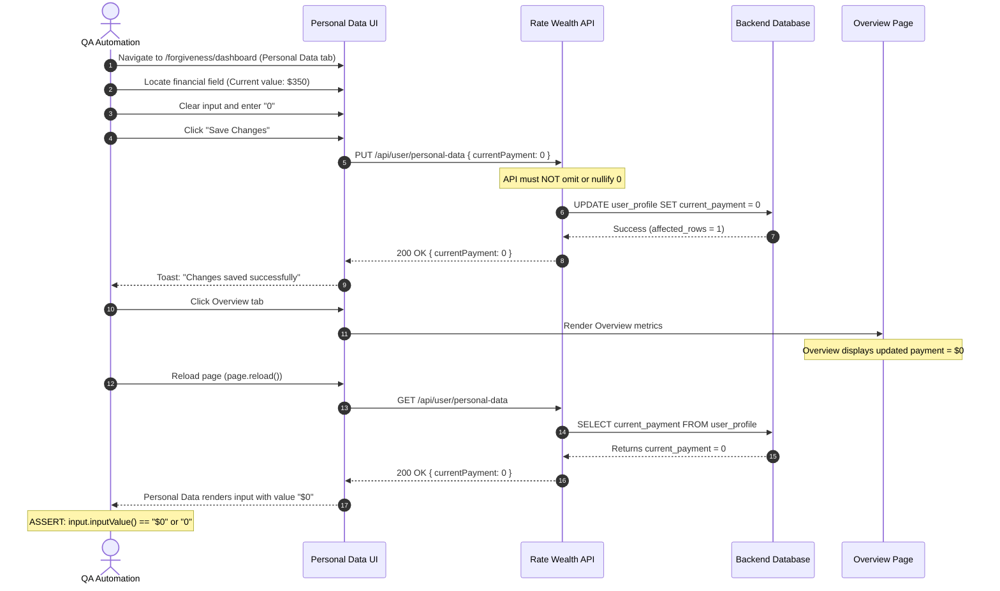

# Test Plan: Data Retention & Zero-Value Persistence Verification

**Jira Reference:** [FAL-3672: Loan/financial field does not update when value is changed to 0](https://rate.atlassian.net/browse/FAL-3672)  
**Component:** Rate Wealth / Student IDR  
**Document Version:** 1.0.0  
**Date:** 2026-09-21  
**Target Applications:** Rate Wealth Dashboard, Student IDR Personal Data & Loan Servicing Modules  
**Applicability:** E2E Playwright Automation, API Contract Validation, Regression & Manual Verification  

---

## 1. Executive Summary & Defect Characterization

### 1.1 Problem Statement (FAL-3672)
In the Rate Wealth / Student IDR platform, user-entered numeric values greater than `0` successfully update and persist upon saving. However, when an existing non-zero value is edited down to `0` (e.g., Current Monthly Federal Loan Payment, Current Gross Annual Income, Accrued Interest, or Asset Balance) and saved:
- The update is **not persisted** to backend storage.
- The previous non-zero value remains in the database.
- Upon refreshing or re-opening the section, the stale value reappears and recalculations in the **Overview** tab fail to reflect the zero value.

### 1.2 Root Cause Analysis (Falsy & Omission Bugs)
In financial software, `0` is a valid, intentional financial state (e.g., zero debt, zero payment, zero income, zero interest rate), NOT an empty or omitted value. Common root causes include:
1. **Falsy JavaScript/TypeScript Checks:**
   ```typescript
   // BUG: 0 is falsy, so field is omitted from payload or falls back to previous value
   if (fieldValue) { payload.amount = fieldValue; }
   const valueToSave = newValue || oldValue; // BUG: 0 evaluates to oldValue!
   ```
2. **Payload Sanitization / Object Stripping:**
   Utilities that remove empty fields (`cleanObject(payload)`) erroneously treating `0` like `null` or `undefined`.
3. **Database / ORM Update Logic:**
   SQL statements using `COALESCE(new_val, old_val)` where empty-string-to-null conversions cause `0` to be treated as `NULL`.
4. **Form State Dirty Checking:**
   Form libraries (e.g., Formik, React Hook Form) failing to flag a field as `isDirty` when transforming between string `'0'` and number `0`.

---

## 2. Scope & Target Fields Inventory

The following loan, income, and asset fields must be verified for zero-value persistence and data retention across the application lifecycle:

| Section | Field Name | Input Type | Valid Zero Representation | Cascade Impact on Overview |
|---|---|---|:---:|---|
| **Personal Data** | Current Monthly Federal Loan Payment | Number / Currency | `$0`, `0` | Overview Monthly Payment, Servicer Comparison |
| **Personal Data** | Current Gross Annual Income | Number / Currency | `$0`, `0` | Discretionary Income, IDR Payment ($0 Floor) |
| **Personal Data** | Spouse Income (if married) | Number / Currency | `$0`, `0` | Joint Household AGI, Joint Payment Calculation |
| **Personal Data** | Applicant Savings | Number / Currency | `$0`, `0` | Tax Bomb Savings Offset |
| **Personal Data** | Spouse / Joint Savings | Number / Currency | `$0`, `0` | Total Household Sinking Fund |
| **Loans** | Loan Entry - Balance | Currency Input | `$0`, `0` | Total Outstanding Balance (Loan Paid Off) |
| **Loans** | Loan Entry - APR / Interest Rate | Percentage Input | `0%`, `0.0%`, `0` | Weighted Average APR across portfolio |
| **Loans** | Loan Entry - Accrued Interest | Currency Input | `$0`, `0` | Total Accrued Interest, Capitalization |
| **Loans** | Loan Entry - Principal | Currency Input | `$0`, `0` | Total Principal for Tax Bomb calculation |
| **Assets** | Asset Entry - Current Balance | Currency Input | `$0`, `0` | Total Assets, Included in Tax Bomb Savings |
| **Repayment** | Forbearance Duration (Months) | Integer Input | `0` | Forgiveness Timeline, Remaining Payments |

---

## 3. Test Scenarios & Detailed Test Cases

### 3.1 Primary Regression Test Matrix (TC-DR-001 to TC-DR-020)

| Test Case ID | Test Category | Scenario & Action | Initial Value | Updated Value | Expected Result & Verification | Priority |
|---|---|---|:---:|:---:|---|:---:|
| **TC-DR-001** | `DIRECT_ZERO_UPDATE` | Update Current Monthly Federal Loan Payment to 0 | `$350` | `0` | Field saves as `$0`; reloads as `$0`; Overview reflects `$0` payment. | **Critical (P0)** |
| **TC-DR-002** | `DIRECT_ZERO_UPDATE` | Update Gross Annual Income to 0 | `$75,000` | `0` | Income saves as `$0`; triggers IDR payment recalculation to `$0` floor. | **Critical (P0)** |
| **TC-DR-003** | `DIRECT_ZERO_UPDATE` | Update Spouse Income to 0 (Married) | `$40,000` | `0` | Spouse income persists as `$0`; Joint AGI equals Applicant AGI. | **High (P1)** |
| **TC-DR-004** | `DIRECT_ZERO_UPDATE` | Update Loan Accrued Interest to 0 | `$1,250` | `0` | Accrued interest saves as `$0`; Total Accrued Interest displays `$0`. | **High (P1)** |
| **TC-DR-005** | `DIRECT_ZERO_UPDATE` | Update Loan Balance to 0 (Paid off loan) | `$24,000` | `0` | Loan balance persists as `$0`; Total Outstanding Balance decreases by $24k. | **High (P1)** |
| **TC-DR-006** | `DIRECT_ZERO_UPDATE` | Update Loan APR to 0.0% (Zero-interest) | `6.5%` | `0%` | APR persists as `0%`; weighted APR calculation accounts for 0.0% rate. | **Medium (P2)** |
| **TC-DR-007** | `DIRECT_ZERO_UPDATE` | Update Asset Balance to 0 | `$15,000` | `0` | Asset balance saves as `$0`; Total Assets and Tax Bomb offset update. | **High (P1)** |
| **TC-DR-008** | `LIFECYCLE_TOGGLE` | Cyclic toggle: `0 -> Non-Zero -> 0 -> Non-Zero` | `$0` | `$500 -> 0 -> $250` | Each transition accurately persists and reflects in database and UI. | **High (P1)** |
| **TC-DR-009** | `TAB_SWITCH_RETENTION` | In-memory tab switching without page reload | `$450` | `0` | Edit to `0` -> Save -> Navigate to Overview -> Return to Personal Data -> Field is `$0`. | **High (P1)** |
| **TC-DR-010** | `HARD_RELOAD_RETENTION` | Full page refresh / cache bust persistence | `$600` | `0` | Edit to `0` -> Save -> Hard refresh (`Ctrl+F5` / `page.reload()`) -> Value is `$0`. | **Critical (P0)** |
| **TC-DR-011** | `COLD_SESSION_RESUME` | Session logout and re-login verification | `$800` | `0` | Edit to `0` -> Save -> Log out -> Log back in -> Field displays `$0`. | **Critical (P0)** |
| **TC-DR-012** | `EMPTY_VS_ZERO` | Explicit Zero (`0`) vs Empty String (`""`) | `$300` | `""` vs `0` | Empty string triggers required field error or clears; explicit `0` is accepted and stored. | **Medium (P2)** |
| **TC-DR-013** | `FORMATTED_ZERO` | Formatted representations of zero | `$500` | `$0.00`, `0.00`, `0` | All representations sanitize to numeric `0` and persist identically. | **Medium (P2)** |
| **TC-DR-014** | `MULTI_FIELD_BATCH` | Batch update with mixed zero & non-zero fields | Multiple | Mixed | Field A updated to `0`, Field B updated to `$1,000`. Both persist correctly. | **High (P1)** |
| **TC-DR-015** | `API_PAYLOAD_VERIFY` | HTTP request/response JSON payload audit | `$400` | `0` | Outgoing PUT/PATCH payload contains explicit `"field": 0` (not `null`/omitted). | **Critical (P0)** |
| **TC-DR-016** | `OVERVIEW_CASCADE` | Overview calculation recalculates on zero update | `$500` | `0` | Overview reactive cards update within 2 seconds of zero persistence. | **High (P1)** |
| **TC-DR-017** | `CANCEL_ROLLBACK` | Discard / Cancel changes without save | `$500` | `0` (unsaved) | Clicking Cancel or switching tabs without saving preserves initial `$500`. | **Medium (P2)** |
| **TC-DR-018** | `BOUNDARY_MIN_VALUE` | Minimum allowable value boundary (0 vs -1) | `$100` | `-1` vs `0` | `-1` is rejected with validation error; `0` is accepted as valid lower bound. | **Medium (P2)** |
| **TC-DR-019** | `MULTI_LOAN_ZEROING` | Zeroing one loan while another loan has balance | `$10k & $20k` | `$0 & $20k` | Only modified loan balance becomes `$0`; other loan retains `$20k`; Total = `$20k`. | **High (P1)** |
| **TC-DR-020** | `SAVINGS_TAX_BOMB_ZERO` | Zeroing savings applied to tax bomb | `$12,500` | `0` | Net tax liability equals gross tax bomb (no savings reduction applied). | **High (P1)** |

---

## 4. End-to-End Test Execution Workflows

### 4.1 UI Flow: Personal Data Zero-Value Persistence (Automated via Playwright)


---

## 5. Automation Strategy & Test Artifacts

1. **Automated Playwright Test Suite:**
   - File: `tests/projects/student-IDR/DATA-RETENTION-ZERO-PERSISTENCE.spec.ts`
   - Covers direct UI interaction, tab navigation, cache reload, and API interception.
2. **API Contract Verification:**
   - Intercept network requests (`page.on('request')` and `page.on('response')`).
   - Validate that the request body explicitly serializes numeric `0`.
   - Validate that the server response status is `200 OK` and returns `0`.
3. **Execution Commands:**
   ```bash
   # Run the zero data retention test suite in Playwright
   npx playwright test tests/projects/student-IDR/DATA-RETENTION-ZERO-PERSISTENCE.spec.ts --project=chromium

   # Run with debug logging and UI tracing
   npx playwright test tests/projects/student-IDR/DATA-RETENTION-ZERO-PERSISTENCE.spec.ts --project=chromium --headed
   ```

---

## 6. Exit & Acceptance Criteria (Bug Resolution for FAL-3672)

To close FAL-3672 and verify data retention across all scenarios:
1. **Zero Acceptance:** Any loan or financial field allows `0` without rejection.
2. **Persistence Guarantee:** After saving `0`, navigating away, reloading the page, or logging out and logging back in returns `0`.
3. **Reactive Integrity:** Overview metrics (Monthly Payment, Total Balance, Tax Liability) recalculate based on `0` without NaN or stale data.
4. **No Falsy Regression:** All automated tests in `DATA-RETENTION-ZERO-PERSISTENCE.spec.ts` pass with 100% success rate across Chromium, Firefox, and WebKit.
