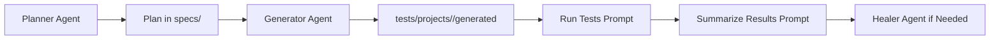

# Test Plans

This directory contains structured test plans for the student loan application automation suite.

## Purpose

Test plans document:
- User scenarios and workflows to test
- Step-by-step test cases
- Expected outcomes and validations
- Seed files for test generation

## Creating Test Plans

Use the **Playwright Test Planner** AI agent to create comprehensive test plans:

```bash
# In GitHub Copilot Chat
@playwright-test-planner Create a test plan for [feature/workflow]
```

## Plan-to-Test Workflow



## Test Plan Structure

Test plans should follow this structure:

```markdown
# [Feature/Flow Name] Test Plan

## Overview
Brief description of what this test plan covers

### 1. [Test Suite Name]
**Seed:** `tests/seed-file.spec.ts`

#### 1.1 [Scenario Name]
**Steps:**
1. Navigate to application
2. Fill in required fields
3. Submit form
4. Verify success message

**Expected:**
- Application advances to next step
- Data is saved correctly
- User sees confirmation

#### 1.2 [Another Scenario]
...
```

## Generating Tests from Plans

Once a test plan is created, use the **Playwright Test Generator** to generate executable test code:

```bash
# In GitHub Copilot Chat
@playwright-test-generator Generate tests for [test plan file]
```

The generator will:
1. Read the test plan structure
2. Execute steps interactively in a real browser
3. Capture actions and generate test code
4. Save tests to `tests/projects/<project>/generated/` with proper naming

## Best Practices

- Keep test plans focused on specific features or workflows
- Use descriptive scenario names
- Include both happy path and edge cases
- Document any special setup requirements
- Reference existing seed files when possible
- Link to relevant application pages or documentation

## Workflow

1. **Plan** → Use Playwright Test Planner to create test plan in `specs/`
2. **Generate** → Use Playwright Test Generator to create test code in `tests/projects/<project>/generated/`
3. **Heal** → Use Playwright Test Healer to fix any failing tests
4. **Maintain** → Update plans as application features change

## Path Convention

- Use repo-relative paths in plans and prompts, such as `tests/projects/student-loan-refi/...`.
- Do not use leading slash path notation like `/tests/...` or `/test-data/...`.

## Authoring References

- Skill authoring: `ai/agents/skills/readme-skills.md`
- Prompt authoring: `ai/agents/prompts/readme-prompts.md`
- Framework overview: `ai/agents/readme-agents.md`

